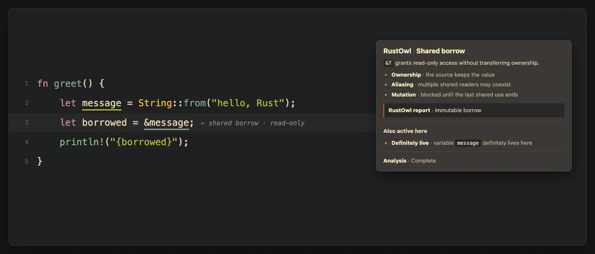
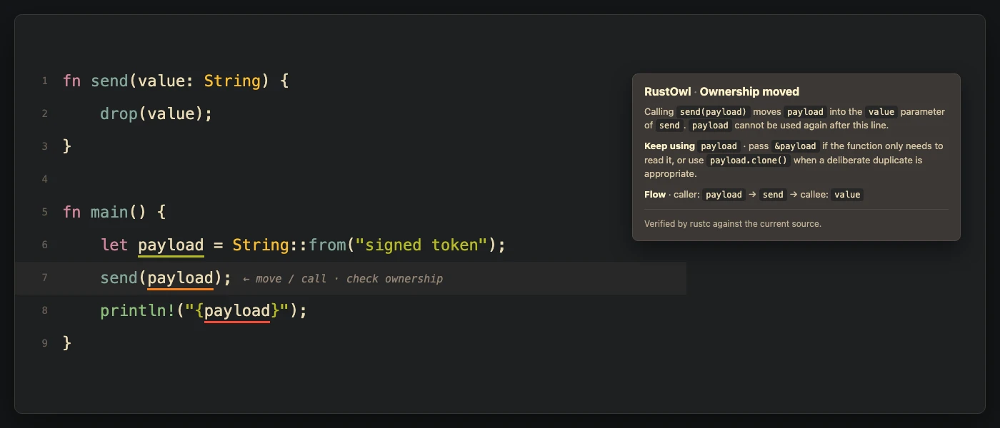
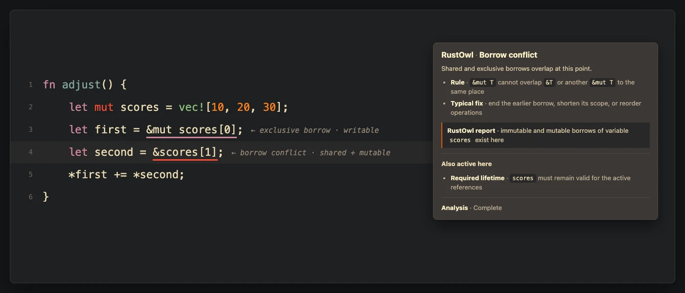
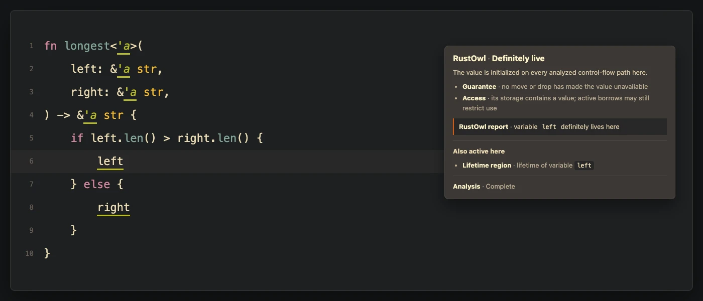
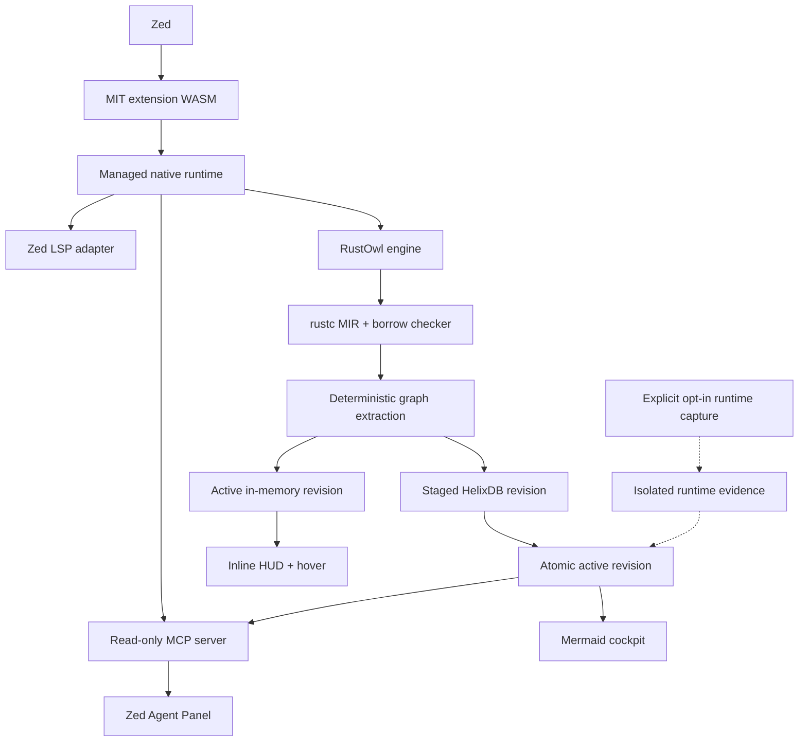

<p align="center">
  
</p>

# RustOwl for Zed

**A compiler-grounded ownership cockpit for Rust, built for Zed developers and
coding agents.**

RustOwl for Zed makes Rust's normally invisible ownership story visible. It
renders lifetime, borrow, move, mutation, call, return, drop, liveness, and
async-suspension evidence as native Zed underlines, inline helpers, and layered
hovers. The same local, revisioned workspace graph powers bounded ownership
traces, Mermaid flow maps, and six read-only tools for Zed's Agent Panel.

It is an independent Zed integration built with care by
[RustyAuth](https://rustyauth.dev).

> [!IMPORTANT]
> [RustOwl](https://github.com/cordx56/rustowl) was created by
> [Kota Mori (`cordx56`)](https://github.com/cordx56). Kota deserves the credit
> for the compiler analysis, LSP server, visual language, and original editor
> integrations. This repository is not an official RustOwl project. Our
> maintained engine fork preserves the original history, attribution, and
> MPL-2.0 licence.

## Status

RustOwl for Zed `0.1.3` is a marketplace candidate under active hardening. The
extension, indexed compiler engine, embedded HelixDB store, and MCP server are
implemented and have been exercised together in Zed Preview on macOS ARM64
with rust-analyzer running alongside RustOwl.

The release workflow builds one checksummed runtime for all six declared
macOS, Linux, and Windows targets. Those matrix builds and clean-install visual
checks must pass in CI before a tag is promoted or submitted to the Zed
Extension Marketplace. Optional runtime-value capture remains a deliberately
separate future capability; this release exposes static compiler evidence and
never claims to have observed program execution.

- [Production roadmap](docs/ownership-cockpit-roadmap.md)
- [Engine architecture](docs/engine-architecture.md)
- [Marketplace release checklist](docs/marketplace-submission.md)
- [Maintained RustOwl engine fork](https://github.com/rusty-auth/rustowl-engine)

## Why this exists

rust-analyzer is the editor authority for symbols, types, navigation,
completion, and ordinary diagnostics. RustOwl adds a different layer:
rustc/MIR/borrow-checker evidence explaining when a value is live, borrowed,
moved, mutated, returned, dropped, or retained across an asynchronous
suspension point.

The product thesis is simple:

> rust-analyzer explains the program's symbols; RustOwl explains the program's
> ownership story.

RustOwl for Zed will continue to run beside Zed's native Rust language server;
it does not replace or fork rust-analyzer.

## The ownership cockpit

The project has four connected product surfaces:

| Surface | Experience |
| --- | --- |
| **Inline HUD** | One high-signal ownership helper per visible line, backed by complete semantic ranges and underlines. |
| **Native hover** | A plain-English consequence first, followed by source-level flow and expandable compiler/MIR evidence. |
| **Workspace cockpit** | Bounded structured and Mermaid views for values, functions, calls, async state, and conflicts. |
| **Agent context** | Bounded, read-only MCP tools and prompts available to enabled Zed Agent Profiles. |

All four surfaces consume the same versioned graph facts. Mermaid and Markdown
are renderers; neither is the source of semantic truth. Source names such as
`message` and `borrowed` are shown in the teaching layer; rustc temporaries
such as `_28` remain available only as advanced provenance.

## What the current client looks like

These are faithful previews of the current adapter output: ownership
explanations in Zed's native LSP hover popover, semantic-token underlines, and
inlay hints. The showcases use a warm Gruvbox-inspired palette chosen to
complement RustyAuth; popover and hint chrome follow the active Zed theme.

Each compact hover uses progressive disclosure so it works for two audiences:

1. **What this means** names the source-level values and explains what the
   developer may read, mutate, move, or use next.
2. **Compiler evidence** preserves certainty, MIR flow kind, internal place
   provenance, source fingerprint, document version, and graph revision for
   experienced Rust engineers investigating precise behavior.

Generic analysis boundaries and compiler-generated function-signature events
do not outrank useful ownership facts. When evidence is conservative or
unresolved, the hover says so instead of presenting a guess as a Rust error.

**Immutable borrowing**

<a href="assets/showcase/zed-rich-borrow.webp"></a>

**Ownership-sensitive calls**

<a href="assets/showcase/zed-rich-move.webp"></a>

**Conflicting borrows**

<a href="assets/showcase/zed-rich-conflict.webp"></a>

**Lifetime relationships**

<a href="assets/showcase/zed-rich-lifetime.webp"></a>

## Full project scope

### A revisioned Cargo-workspace ownership graph

The maintained engine converts cursor-oriented RustOwl reports and MIR into a
deterministic graph covering analyzed crates, modules, files, functions,
bindings, MIR places, calls, borrows, moves, mutations, returns, drops,
control-flow blocks, suspension points, and diagnostics.

Every semantically changed compiler analysis produces an immutable revision;
an unchanged restart reuses the active revision. Editor and agent responses
identify the revision and source fingerprint they came from. The previous
complete revision remains available while new compiler work runs; cancelled
or incomplete analysis is never activated.

The graph will trace:

- direct calls, receivers, arguments, parameters, and returned places;
- field projections and partial moves;
- shared and mutable borrows, reborrows, aliasing, and mutation-through-reference;
- generic and statically resolved trait calls;
- closures and captured places;
- async-generated state, suspension, resume, and cancellation boundaries; and
- conservative or unresolved boundaries for dynamic dispatch, macros, FFI,
  raw pointers, and unsafe code.

HelixDB is embedded behind an engine-owned storage interface. The editor's hot
path remains in memory, and the in-memory store remains a tested fallback.
Persistence uses two bounded A/B generations: a new revision is staged and
validated in the inactive slot, an atomic pointer activates it, and the other
slot remains available for rollback. Users do not need Docker, a database
daemon, a cloud account, or a Helix service.

### Cross-function and async explanations

The cockpit and agent tools answer questions that a single-line tooltip cannot:

- Where did this value originate and where is ownership transferred?
- Which borrow remains active across this call or `.await`?
- What is retained inside the generated future?
- Why might a future fail `Send` or `'static` requirements?
- Which callers are affected if a parameter changes from borrowed to owned?
- Where is a value mutated through several layers of references?
- At which possible points is the value returned, cancelled, or dropped?

Cross-function fidelity is delivered in tested levels. A graph query stops at
an unresolved boundary unless conservative expansion is explicitly requested.
Storage or rendering is never allowed to invent a missing ownership edge.

### Workspace cockpit and diagrams

Until Zed exposes custom extension panes, cockpit queries return bounded
structured graph slices and Mermaid source that can be rendered beside the
source or directly in an agent response. Current graph views cover:

- selected-value ownership flow;
- function memory and ownership state machines;
- caller/callee transfer paths;
- async suspension and cancellation state;
- borrow-conflict control-flow branches;
- workspace ownership summaries; and
- source-backed, agent-guided ownership tours.

RustOwl does not write generated cockpit files into the tracked source tree.

### Zed Agent Panel access through MCP

The extension registers the local `rustowl-ownership` stdio context server
alongside its language server. The managed runtime supplies `rustowl-mcp`,
allowing enabled Zed Agent Profiles to query the active ownership revision.
The LSP process is the only graph writer; MCP opens the activated Helix slot as
a bounded, read-only consumer. A short-lived worktree registry removes the
startup race when Zed launches the Agent Panel before compiler indexing has
registered every project root.

The tool surface is deliberately focused:

| MCP tool | Purpose |
| --- | --- |
| `rustowl_workspace_summary` | Summarize active revisions, graph kinds, certainty counts, and freshness. |
| `rustowl_inspect_range` | Inspect bounded ownership, borrow, lifetime, control-flow, and async evidence at source lines. |
| `rustowl_trace_ownership` | Traverse a value forward or backward through calls, moves, borrows, returns, awaits, and drops. |
| `rustowl_render_mermaid` | Render a previously returned graph reference as bounded Mermaid source. |
| `rustowl_search` | Find bindings, places, functions, events, and diagnostics by source/compiler label. |
| `rustowl_async_state` | Explain retained future state, suspension, resume, and cancellation/drop relationships. |

Three audience-aware prompts guide agents through ownership debugging,
async-state analysis, and ownership-preserving refactors:
`debug-rust-ownership`, `explain-rust-async-state`, and
`plan-rust-ownership-refactor`.

Agent responses are bounded and include exact workspace-relative spans,
freshness, compiler and engine versions, certainty, truncation, and omitted
counts. No agent tool can write the graph, launch compiler work, edit source,
or execute the user's program.

### Optional runtime evidence

Static ownership semantics and observed runtime execution are different kinds
of truth. A later, explicitly opt-in lane will correlate compiler-assigned
graph IDs with instrumented runtime events without relabelling static
possibilities as executed paths.

The first capture policy records control flow and event identity rather than
arbitrary values. More detailed metadata or approved values requires an
escalating user-selected policy, redaction, byte limits, retention controls,
and local encryption. Agents cannot start capture, silently execute code, or
read arbitrary memory.

This lane is intended to show which statically described calls, mutations,
returns, drops, tasks, and suspension events were observed in one selected run.
One run never proves that other possible paths are unreachable.

## Truth and certainty

Every editor, diagram, and agent surface follows one shared truth contract:

- **compiler-proven** — derived directly from rustc, MIR, or borrow-checker facts;
- **source-resolved** — connected by an identified source-level resolver;
- **conservative** — a bounded over-approximation rendered using “may” language;
- **unresolved** — an observed event whose remote endpoint is unknown; and
- **observed-in-run** — optional runtime evidence tied to one build and run.

The static graph describes possible program semantics, not runtime values or
the branch a program actually executed. Stale facts always identify their
completed revision and never masquerade as analysis of unsaved code.

“Live” initially means responsive presentation of the latest complete
revision, immediate invalidation of affected regions, and atomic replacement
after save or a bounded idle debounce—not a full rustc-quality workspace build
on every keystroke.

## Target architecture



Release archives will contain the adapter, RustOwl engine, compiler wrapper,
licences, notices, manifest, checksums, and software bill of materials. The
same engine version will serve LSP and MCP modes so graph schema and protocol
versions cannot drift.

## Install

Once published, open Zed's Extensions view and search for **RustOwl**. During
development, clone this repository and use **Install Dev Extension** from
Zed's Extensions view.

The extension downloads one target-specific runtime archive from this
repository. It contains the Zed adapter, maintained RustOwl engine, compiler
wrapper, MCP server, manifest, checksums, and the required MIT, MPL-2.0, and
Apache-2.0 notices.

On its first managed launch, the adapter asks RustOwl to install the matching
Rust compiler components. This is a one-time, potentially large download
performed by RustOwl's toolchain installer; subsequent starts reuse it.

Development settings may point the `rustowl` language server at a local adapter
and engine. A user-supplied engine remains under the user's control and should
already have its matching compiler toolchain installed.

## Configure Zed

RustOwl runs alongside `rust-analyzer`. Add `rustowl` to the Rust language
servers and enable semantic tokens and inlay hints:

```jsonc
{
  "languages": {
    "Rust": {
      "language_servers": ["rust-analyzer", "rustowl", "..."],
      "semantic_tokens": "combined"
    }
  },
  "inlay_hints": {
    "enabled": true,
    "show_other_hints": true
  },
  "global_lsp_settings": {
    "semantic_token_rules": [
      {
        "token_type": "rustowlDefinitelyLive",
        "underline": "#52d65b"
      },
      {
        "token_type": "rustowlMaybeInitialized",
        "underline": "#52d65b"
      },
      {
        "token_type": "rustowlImmutableBorrow",
        "underline": "#647cf3"
      },
      {
        "token_type": "rustowlMutableBorrow",
        "underline": "#d65bd1"
      },
      {
        "token_type": "rustowlMoveOrCall",
        "underline": "#d69852"
      },
      {
        "token_type": "rustowlOutlive",
        "underline": "#d65252"
      }
    ]
  }
}
```

The colours follow RustOwl's visual vocabulary:

- green — definitely live or maybe initialized;
- blue — immutable borrow;
- purple — mutable borrow;
- orange — move or ownership-sensitive function call; and
- red — outlive or conflicting-borrow error.

After a save, ownership events in visible code receive compact helpers such as
`← shared borrow · read-only`, `← move / call · check ownership`, and
`← borrow conflict · shared + mutable`. When several events occur on one line,
the adapter shows the most useful one inline and keeps the complete set in the
hover.

The extension also exposes the `rustowl-ownership` context server. Enable its
tools for the desired Zed Agent Profile; enabling a tool permits its bounded
response to be sent to the model provider selected by the user. The server
does not receive unsaved buffers and has no write or execution tools.

## How the adapter works

The maintained engine exposes indexed `rustowl/inspectRange`,
`rustowl/ownershipGraph`, `rustowl/workspaceMap`, and
`rustowl/analysisStatus` requests plus `rustowl/analysisUpdated`. The original
`rustowl/cursor` request remains as a compatibility fallback. Zed can launch
language servers, but its extension API does not let an extension draw
arbitrary editor decorations, so the adapter translates graph evidence into
standard LSP features.

The `rustowl-zed-adapter` bridges that gap:

1. Opening a Rust document triggers workspace indexing; a save requests a new
   complete compiler revision.
2. The adapter prefetches indexed graph evidence for open documents and reacts
   to revision-update notifications.
3. Zed requests standard semantic tokens, inlay hints, or hover content.
4. The adapter exposes the compiler ranges as semantic tokens, compact
   inlay hints, and Markdown hovers.
5. Hover may request a narrower graph slice for detail, but it is never required
   to activate inline visuals.

Unsaved changes invalidate affected compiler evidence immediately. Zed keeps
ordinary rust-analyzer feedback, while RustOwl resumes from the latest complete
saved revision after the next analysis finishes.

## Privacy, reliability, and performance

- Analysis, indexing, graph storage, and diagram generation are local by default.
- No source, graph, telemetry, or credentials are uploaded by RustOwl.
- MCP only returns data after a user enables and invokes a tool through an agent.
- Workspace-relative paths and bounded query budgets prevent arbitrary file access.
- The LSP is the single graph writer; MCP opens the active revision read-only.
- Atomic activation preserves the previous valid revision after cancellation or a crash.
- A missing, locked, corrupt, or disabled persisted index falls back to memory.
- Generated Mermaid labels are escaped before rendering.
- Release artifacts carry licences, notices, checksums, and an SBOM.

Post-analysis performance gates target cached hovers below 30 ms p95,
visible-range queries below 50 ms p95, six-hop ownership traces below 100 ms
p95, and MCP workspace summaries below 200 ms p95. These are release criteria,
not claims about the current prototype.

## Delivery status

| Milestone | Outcome |
| --- | --- |
| **M0 — Contracts** | Implemented: stable graph IDs, certainty model, ADRs, fixtures, and benchmark harness. |
| **M1 — In-memory graph** | Implemented: deterministic extraction and bounded range, trace, and map queries. |
| **M2 — Indexed LSP** | Implemented: range/graph/map/status methods, freshness enforcement, and update notifications. |
| **M3 — HelixDB persistence** | Implemented: embedded native records, validated staging, read-only readers, recovery, memory fallback, and bounded A/B rotation. |
| **M4 — Zed cockpit** | Implemented: proactive inline HUD, layered hovers, async helpers, and Mermaid rendering through the shared graph. |
| **M5 — Agent Panel** | Implemented: six read-only MCP tools, three audience-aware prompts, context-server registration, bounded output, and protocol smoke tests. |
| **M6 — Runtime evidence** | Future, opt-in lane; intentionally excluded from the static-analysis release. |
| **M7 — Unified runtime** | Implemented in release automation: six target archives, compatibility manifest, checksums, licences, notices, upgrade, and rollback. |
| **M8 — Beta hardening** | In progress: local macOS live-editor gates pass; the complete CI platform and clean-install matrix gates release promotion. |
| **M9 — Marketplace GA** | Pending the tagged runtime matrix and upstream Zed extensions-repository review. |

Read the [complete roadmap](docs/ownership-cockpit-roadmap.md) for graph schema,
protocol contracts, performance objectives, security gates, and milestone exit
criteria.

## Current limitations

- Automatic visuals are based on saved compiler analysis; unsaved edits invalidate stale
  ownership ranges until the next complete revision.
- Zed semantic tokens must be enabled and styled; inline helpers additionally
  require inlay hints.
- Zed supports coloured semantic-token underlines but not every solid/wavy
  distinction used by RustOwl's other clients.
- The first Cargo-workspace analysis and managed compiler-toolchain download can
  take time.
- Zed does not currently expose a custom extension-pane API, so detailed visual
  traces are returned as structured data and Mermaid rather than a bespoke
  always-on canvas.
- Dynamic dispatch, FFI, raw pointers, macros, and unsupported MIR remain
  explicitly conservative or unresolved instead of being guessed.
- Runtime values and actually executed paths are not captured. The optional
  runtime-evidence design remains separate and opt-in.

## Develop

Requirements:

- a current stable Rust toolchain for the extension and adapter;
- the `wasm32-wasip2` target;
- the engine fork's pinned Rust toolchain for compiler work; and
- RustOwl on `PATH` for the current end-to-end smoke fixture.

Clone the maintained engine fork and configure the original project as its
`upstream` remote:

```sh
git submodule update --init --recursive
./scripts/setup-engine-remotes.sh
```

Build and test the current extension and adapter:

```sh
rustup target add wasm32-wasip2
cargo check --target wasm32-wasip2
cargo test --manifest-path adapter/Cargo.toml
cargo clippy --manifest-path adapter/Cargo.toml --all-targets -- -D warnings
cargo build --manifest-path adapter/Cargo.toml
RUSTOWL_AUTO_SETUP=0 node scripts/smoke.mjs /path/to/rustowl
node scripts/mcp-smoke.mjs --server /path/to/rustowl-mcp
```

Build and test the maintained compiler engine separately:

```sh
cargo test --manifest-path engine/Cargo.toml
cargo clippy --manifest-path engine/Cargo.toml --all-targets -- -D warnings
```

The Node smoke fixture is only a local protocol harness; production release
gates also require a clean installation and visual verification in the real
Zed editor on every supported platform.

## Prior art and collaboration

The graph design is being compared with
[Place Capability Graphs](https://github.com/prusti/pcg) before schema version
1 is frozen. [Flowistry](https://github.com/willcrichton/flowistry) informs
modular information-flow summaries. Aquascope, RustViz, BORIS, OwnSight, and
mind-expander inform visual language and agent navigation.

These projects are a design and validation corpus, not unreviewed production
dependencies. Source enters the product only through a separately reviewed,
licence-compatible dependency or an independent implementation of a published
interface. Generally useful RustOwl protocol improvements should be proposed
upstream.

## A small love letter from RustyAuth

[RustyAuth](https://github.com/rusty-auth/rustyauth) is passkey-first
authentication built in Rust. We care about tools that make Rust's guarantees
easier to see, learn, and trust. This project is our thank-you to RustOwl and
to the wider Rust community.

## Attribution and licensing

The Zed extension and adapter are independently written and licensed under the
[MIT License](LICENSE), one of the licences accepted by the Zed Extension
Marketplace.

RustOwl is licensed under the Mozilla Public License 2.0. Its source is pinned
in the [`engine`](engine) Git submodule from the RustyAuth-maintained fork,
with the original repository retained as `upstream`. MPL-covered engine files
remain MPL-2.0 and are not relicensed by this repository.

HelixDB is linked from the immutable revision recorded in
[`engine/Cargo.lock`](engine/Cargo.lock) and mirrored as the
[`references/helix-db`](references/helix-db) submodule under Apache-2.0. See
[THIRD_PARTY_NOTICES.md](THIRD_PARTY_NOTICES.md) for attribution, provenance,
and distribution obligations.
