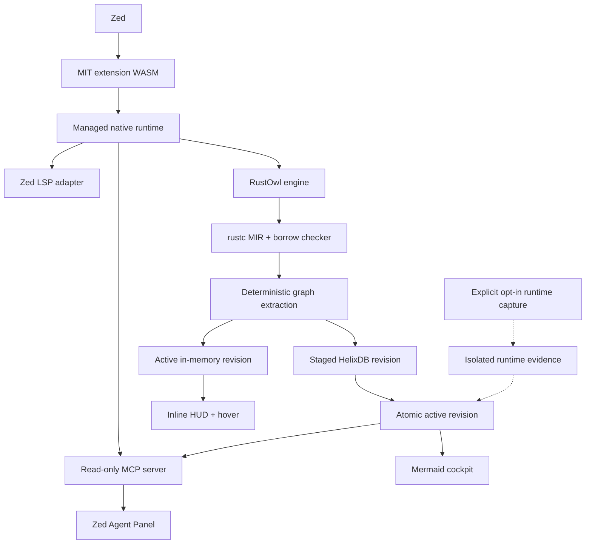

<p align="center">
  
</p>

# RustOwl for Zed

**A compiler-grounded ownership cockpit for Rust, built for Zed developers and
coding agents.**

RustOwl for Zed makes Rust's normally invisible ownership story visible. The
current client renders RustOwl's lifetime, borrow, move, call, liveness, and
conflict reports as native Zed underlines, inline helpers, and educational
hovers. The project is growing into a local-first workspace intelligence layer
that can trace ownership through functions and async suspension points, render
navigable flow maps, and give Zed's Agent Panel the same bounded compiler
evidence through MCP.

It is an independent Zed integration built with care by
[RustyAuth](https://rustyauth.dev).

> [!IMPORTANT]
> [RustOwl](https://github.com/cordx56/rustowl) was created by
> [Kota Mori (`cordx56`)](https://github.com/cordx56). Kota deserves the credit
> for the compiler analysis, LSP server, visual language, and original editor
> integrations. This repository is not an official RustOwl project. Our
> maintained engine fork preserves the original history, attribution, and
> MPL-2.0 licence.

## Status

RustOwl for Zed is under active development ahead of its first Zed Extension
Marketplace submission.

The current `0.1.3` development client is the working foundation. It has run as
a Zed Preview dev extension on macOS ARM64 with RustOwl and rust-analyzer active
together, managed toolchain installation, semantic underlines, automatic
multi-value inlay hints, and native Markdown hovers.

The complete ownership cockpit is not yet a production release. Workspace-wide
graph indexing, persistent HelixDB storage, Agent Panel tools, runtime
correlation, unified packaging, and cross-platform release gates are being
implemented in explicit milestones. Planned capabilities in this README are
labelled as such.

- [Production roadmap](docs/ownership-cockpit-roadmap.md)
- [Engine architecture](docs/engine-architecture.md)
- [Maintained RustOwl engine fork](https://github.com/rusty-auth/rustowl-engine)

## Why this exists

rust-analyzer is the editor authority for symbols, types, navigation,
completion, and ordinary diagnostics. RustOwl adds a different layer:
rustc/MIR/borrow-checker evidence explaining when a value is live, borrowed,
moved, mutated, returned, dropped, or retained across an asynchronous
suspension point.

The product thesis is simple:

> rust-analyzer explains the program's symbols; RustOwl explains the program's
> ownership story.

RustOwl for Zed will continue to run beside Zed's native Rust language server;
it does not replace or fork rust-analyzer.

## The ownership cockpit

The project has four connected product surfaces:

| Surface | Experience |
| --- | --- |
| **Inline HUD** | One high-signal ownership helper per visible line, backed by complete semantic ranges and underlines. |
| **Native hover** | A compact ownership rule, exact RustOwl report, active facts, short timeline, freshness, and uncertainty. |
| **Workspace cockpit** | Mermaid and structured views for values, functions, calls, async state, conflicts, and workspace hotspots. |
| **Agent context** | Bounded, read-only MCP tools and prompts available to enabled Zed Agent Profiles. |

All four surfaces consume the same versioned graph facts. Mermaid and Markdown
are renderers; neither is the source of semantic truth.

## What the current client looks like

These are faithful previews of the current adapter output: ownership
explanations in Zed's native LSP hover popover, semantic-token underlines, and
inlay hints. The showcases use a warm Gruvbox-inspired palette chosen to
complement RustyAuth; popover and hint chrome follow the active Zed theme.

Each compact hover preserves RustOwl's report, then adds the relevant ownership
rule, its practical effect, a likely fix when appropriate, other lifetime
states active at that location, and the current analysis state.

**Immutable borrowing**

<a href="assets/showcase/zed-rich-borrow.webp"></a>

**Ownership-sensitive calls**

<a href="assets/showcase/zed-rich-move.webp"></a>

**Conflicting borrows**

<a href="assets/showcase/zed-rich-conflict.webp"></a>

**Lifetime relationships**

<a href="assets/showcase/zed-rich-lifetime.webp"></a>

## Full project scope

### A revisioned Cargo-workspace ownership graph

The maintained engine is being extended from cursor-oriented reports into a
deterministic graph covering analyzed crates, modules, files, functions,
bindings, MIR places, calls, borrows, moves, mutations, returns, drops,
control-flow blocks, suspension points, and diagnostics.

Every completed compiler analysis produces an immutable revision. Editor and
agent responses identify the revision and source fingerprint they came from.
The previous complete revision remains available while new compiler work runs;
cancelled or incomplete analysis is never activated.

The graph will trace:

- direct calls, receivers, arguments, parameters, and returned places;
- field projections and partial moves;
- shared and mutable borrows, reborrows, aliasing, and mutation-through-reference;
- generic and statically resolved trait calls;
- closures and captured places;
- async-generated state, suspension, resume, and cancellation boundaries; and
- conservative or unresolved boundaries for dynamic dispatch, macros, FFI,
  raw pointers, and unsafe code.

HelixDB is planned as an embedded persistent graph store behind an
engine-owned interface. The editor's hot path remains in memory, and the
in-memory store remains a fully tested fallback. Users will not need Docker, a
database daemon, a cloud account, or a Helix service.

### Cross-function and async explanations

The cockpit is intended to answer questions that a single-line tooltip cannot:

- Where did this value originate and where is ownership transferred?
- Which borrow remains active across this call or `.await`?
- What is retained inside the generated future?
- Why might a future fail `Send` or `'static` requirements?
- Which callers are affected if a parameter changes from borrowed to owned?
- Where is a value mutated through several layers of references?
- At which possible points is the value returned, cancelled, or dropped?

Cross-function fidelity is delivered in tested levels. A graph query stops at
an unresolved boundary unless conservative expansion is explicitly requested.
Storage or rendering is never allowed to invent a missing ownership edge.

### Workspace cockpit and diagrams

Until Zed exposes custom extension panes, planned cockpit views are generated
as cache-owned Markdown documents that can be opened beside the source and
rendered with Zed's Mermaid preview. Planned views include:

- selected-value ownership flow;
- function memory and ownership state machines;
- caller/callee transfer paths;
- async suspension and cancellation state;
- borrow-conflict control-flow branches;
- workspace ownership hotspots; and
- source-backed, agent-guided architecture tours.

Generated cockpit files stay outside the tracked source tree unless the user
explicitly exports one.

### Zed Agent Panel access through MCP

The extension will register a local stdio context server alongside its language
server. The same managed runtime will expose `rustowl mcp`, allowing enabled
Zed Agent Profiles to query the active ownership revision. The LSP process is
the only graph writer; the MCP process is a bounded, read-only consumer.

The initial tool surface is deliberately focused:

| MCP tool | Purpose |
| --- | --- |
| `rustowl_workspace_overview` | Summarize crates, functions, stale files, conflicts, async functions, hotspots, and index health. |
| `rustowl_explain_location` | Explain liveness, borrows, moves, mutations, drops, async retention, and uncertainty at a source location. |
| `rustowl_trace_ownership` | Traverse a value forward or backward through calls, moves, borrows, returns, awaits, and drops. |
| `rustowl_function_flow` | Return a structured function ownership state machine and its externally visible effects. |
| `rustowl_find_borrow_risks` | Find compiler errors, high-value teaching situations, and conservative risks without conflating them. |
| `rustowl_render_mermaid` | Render a previously returned graph reference as bounded Mermaid source. |

Planned prompts cover explaining ownership at a chosen experience level,
reviewing async borrows, and planning ownership-preserving refactors.

Agent responses are bounded and include exact workspace-relative spans,
freshness, compiler and engine versions, certainty, truncation, and omitted
counts. No agent tool launches compiler work or executes the user's program in
the first release.

### Optional runtime evidence

Static ownership semantics and observed runtime execution are different kinds
of truth. A later, explicitly opt-in lane will correlate compiler-assigned
graph IDs with instrumented runtime events without relabelling static
possibilities as executed paths.

The first capture policy records control flow and event identity rather than
arbitrary values. More detailed metadata or approved values requires an
escalating user-selected policy, redaction, byte limits, retention controls,
and local encryption. Agents cannot start capture, silently execute code, or
read arbitrary memory.

This lane is intended to show which statically described calls, mutations,
returns, drops, tasks, and suspension events were observed in one selected run.
One run never proves that other possible paths are unreachable.

## Truth and certainty

Every editor, diagram, and agent surface follows one shared truth contract:

- **compiler-proven** — derived directly from rustc, MIR, or borrow-checker facts;
- **source-resolved** — connected by an identified source-level resolver;
- **conservative** — a bounded over-approximation rendered using “may” language;
- **unresolved** — an observed event whose remote endpoint is unknown; and
- **observed-in-run** — optional runtime evidence tied to one build and run.

The static graph describes possible program semantics, not runtime values or
the branch a program actually executed. Stale facts always identify their
completed revision and never masquerade as analysis of unsaved code.

“Live” initially means responsive presentation of the latest complete
revision, immediate invalidation of affected regions, and atomic replacement
after save or a bounded idle debounce—not a full rustc-quality workspace build
on every keystroke.

## Target architecture



Release archives will contain the adapter, RustOwl engine, compiler wrapper,
licences, notices, manifest, checksums, and software bill of materials. The
same engine version will serve LSP and MCP modes so graph schema and protocol
versions cannot drift.

## Install

Once published, open Zed's Extensions view and search for **RustOwl**. During
development, clone this repository and use **Install Dev Extension** from
Zed's Extensions view.

The current development extension automatically downloads:

- the adapter released from this repository; and
- an unmodified RustOwl binary from the
  [official RustOwl releases](https://github.com/cordx56/rustowl/releases).

On its first managed launch, the adapter asks RustOwl to install the matching
Rust compiler components. This is a one-time, potentially large download
performed by RustOwl's toolchain installer; subsequent starts reuse it.

If `rustowl` or `rustowl-zed-adapter` is already on `PATH`, the extension uses
it instead. A user-supplied RustOwl installation remains under the user's
control and should already have its matching toolchain installed.

The target production release replaces the two independent downloads with one
versioned and checksummed runtime bundle for macOS, Linux, and Windows on ARM64
and x86-64.

## Configure Zed

RustOwl runs alongside `rust-analyzer`. Add `rustowl` to the Rust language
servers and enable semantic tokens and inlay hints:

```jsonc
{
  "languages": {
    "Rust": {
      "language_servers": ["rust-analyzer", "rustowl", "..."],
      "semantic_tokens": "combined"
    }
  },
  "inlay_hints": {
    "enabled": true,
    "show_other_hints": true
  },
  "global_lsp_settings": {
    "semantic_token_rules": [
      {
        "token_type": "rustowlDefinitelyLive",
        "underline": "#52d65b"
      },
      {
        "token_type": "rustowlMaybeInitialized",
        "underline": "#52d65b"
      },
      {
        "token_type": "rustowlImmutableBorrow",
        "underline": "#647cf3"
      },
      {
        "token_type": "rustowlMutableBorrow",
        "underline": "#d65bd1"
      },
      {
        "token_type": "rustowlMoveOrCall",
        "underline": "#d69852"
      },
      {
        "token_type": "rustowlOutlive",
        "underline": "#d65252"
      }
    ]
  }
}
```

The colours follow RustOwl's visual vocabulary:

- green — definitely live or maybe initialized;
- blue — immutable borrow;
- purple — mutable borrow;
- orange — move or ownership-sensitive function call; and
- red — outlive or conflicting-borrow error.

After a save, ownership events in visible code receive compact helpers such as
`← shared borrow · read-only`, `← move / call · check ownership`, and
`← borrow conflict · shared + mutable`. When several events occur on one line,
the adapter shows the most useful one inline and keeps the complete set in the
hover.

Agent tools will be enabled separately through Zed's Agent Profile manager once
the MCP milestone ships. Enabling a tool permits its bounded response to be
sent to the model provider selected by the user.

## How the current adapter works

RustOwl currently exposes ownership information through the custom
`rustowl/cursor` LSP request. Zed can launch language servers, but its extension
API does not let the extension itself send arbitrary LSP requests or draw
arbitrary editor decorations.

The `rustowl-zed-adapter` bridges that gap:

1. A save asks RustOwl to analyze the Cargo workspace.
2. Zed requests standard inlay hints for the displayed Rust range.
3. The adapter preloads relevant `rustowl/cursor` results and merges their
   ownership ranges.
4. The adapter exposes those ranges as standard semantic tokens, compact
   inlay hints, and Markdown hovers.
5. A normal hover refreshes the selected value and opens its richer card; it
   is not intended to be required before inline visuals appear.

The indexed engine protocol replaces cursor fan-out with bounded methods for
visible ranges, ownership graphs, workspace maps, analysis status, and
revision-update notifications while preserving compatibility with existing
`rustowl/cursor` clients.

## Privacy, reliability, and performance

- Analysis, indexing, graph storage, and diagram generation are local by default.
- No source, graph, telemetry, or credentials are uploaded by RustOwl.
- MCP only returns data after a user enables and invokes a tool through an agent.
- Workspace-relative paths and bounded query budgets prevent arbitrary file access.
- The LSP is the single graph writer; MCP opens the active revision read-only.
- Atomic activation preserves the previous valid revision after cancellation or a crash.
- A missing, locked, corrupt, or disabled persisted index falls back to memory.
- Generated Mermaid labels are escaped before rendering.
- Release artifacts carry licences, notices, checksums, and an SBOM.

Post-analysis performance gates target cached hovers below 30 ms p95,
visible-range queries below 50 ms p95, six-hop ownership traces below 100 ms
p95, and MCP workspace summaries below 200 ms p95. These are release criteria,
not claims about the current prototype.

## Roadmap

| Milestone | Outcome |
| --- | --- |
| **M0 — Contracts** | Stable graph IDs, certainty model, PCG comparison, Flowistry-style summary prototype, fixtures, and benchmarks. |
| **M1 — In-memory graph** | Deterministic workspace extraction and bounded range, trace, and map queries. |
| **M2 — Indexed LSP** | `inspectRange`, ownership graph, workspace map, freshness enforcement, and update notifications. |
| **M3 — HelixDB shadow mode** | Embedded persistence, parity tests, atomic revisions, recovery, compaction, and memory fallback. |
| **M4 — Zed cockpit** | Automatic inline HUD, compact flow hovers, async helpers, and Mermaid workspace views. |
| **M5 — Agent Panel** | Six MCP tools, three prompts, Agent Profile registration, and end-to-end Zed agent tests. |
| **M6 — Runtime evidence** | Explicit opt-in instrumentation and safe correlation of selected runs with static graph IDs. |
| **M7 — Unified runtime** | Checksummed native bundles, compatibility checks, licences, SBOM, upgrade, and rollback. |
| **M8 — Beta hardening** | Large-workspace, rapid-edit, offline, low-disk, accessibility, privacy, and security testing. |
| **M9 — Marketplace GA** | Signed releases, supported-version matrix, clean-install tests, documentation, and Zed submission. |

Read the [complete roadmap](docs/ownership-cockpit-roadmap.md) for graph schema,
protocol contracts, performance objectives, security gates, and milestone exit
criteria.

## Current limitations

- The development adapter still discovers visible facts through bounded
  `rustowl/cursor` prefetch rather than the planned indexed range method.
- Automatic visuals are based on saved analysis; unsaved edits invalidate stale
  ownership ranges until the next complete revision.
- Zed semantic tokens must be enabled and styled; inline helpers additionally
  require inlay hints.
- Zed supports coloured semantic-token underlines but not every solid/wavy
  distinction used by RustOwl's other clients.
- The first Cargo-workspace analysis and managed compiler-toolchain download can
  take time.
- The workspace cockpit, Helix persistence, MCP tools, runtime evidence, and
  unified production bundle remain roadmap milestones.

## Develop

Requirements:

- a current stable Rust toolchain for the extension and adapter;
- the `wasm32-wasip2` target;
- the engine fork's pinned Rust toolchain for compiler work; and
- RustOwl on `PATH` for the current end-to-end smoke fixture.

Clone the maintained engine fork and configure the original project as its
`upstream` remote:

```sh
git submodule update --init --recursive
./scripts/setup-engine-remotes.sh
```

Build and test the current extension and adapter:

```sh
rustup target add wasm32-wasip2
cargo check --target wasm32-wasip2
cargo test --manifest-path adapter/Cargo.toml
cargo clippy --manifest-path adapter/Cargo.toml --all-targets -- -D warnings
cargo build --manifest-path adapter/Cargo.toml
node scripts/smoke.mjs /path/to/rustowl
```

Build and test the maintained compiler engine separately:

```sh
cargo test --manifest-path engine/Cargo.toml
cargo clippy --manifest-path engine/Cargo.toml --all-targets -- -D warnings
```

The Node smoke fixture is only a local protocol harness; production release
gates also require a clean installation and visual verification in the real
Zed editor on every supported platform.

## Prior art and collaboration

The graph design is being compared with
[Place Capability Graphs](https://github.com/prusti/pcg) before schema version
1 is frozen. [Flowistry](https://github.com/willcrichton/flowistry) informs
modular information-flow summaries. Aquascope, RustViz, BORIS, OwnSight, and
mind-expander inform visual language and agent navigation.

These projects are a design and validation corpus, not unreviewed production
dependencies. Source enters the product only through a separately reviewed,
licence-compatible dependency or an independent implementation of a published
interface. Generally useful RustOwl protocol improvements should be proposed
upstream.

## A small love letter from RustyAuth

[RustyAuth](https://github.com/rusty-auth/rustyauth) is passkey-first
authentication built in Rust. We care about tools that make Rust's guarantees
easier to see, learn, and trust. This project is our thank-you to RustOwl and
to the wider Rust community.

## Attribution and licensing

The Zed extension and adapter are independently written and licensed under the
[MIT License](LICENSE), one of the licences accepted by the Zed Extension
Marketplace.

RustOwl is licensed under the Mozilla Public License 2.0. Its source is pinned
in the [`engine`](engine) Git submodule from the RustyAuth-maintained fork,
with the original repository retained as `upstream`. MPL-covered engine files
remain MPL-2.0 and are not relicensed by this repository.

HelixDB is planned under its Apache-2.0 licence and will be pinned immutably
before production use. See [THIRD_PARTY_NOTICES.md](THIRD_PARTY_NOTICES.md) for
current attribution, provenance, and distribution obligations.
