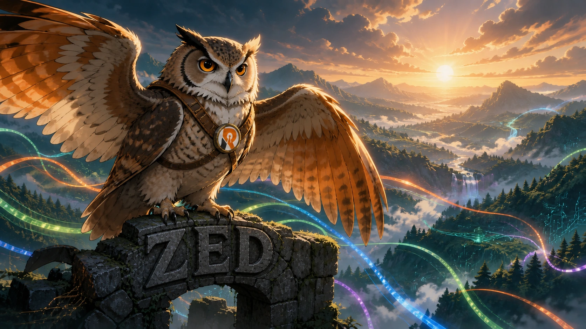
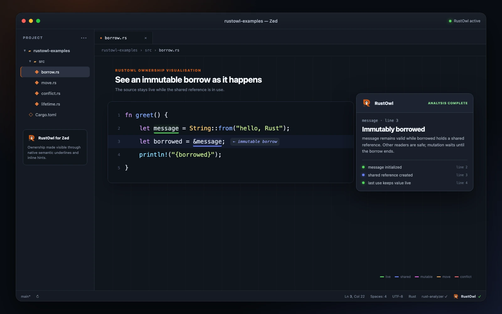
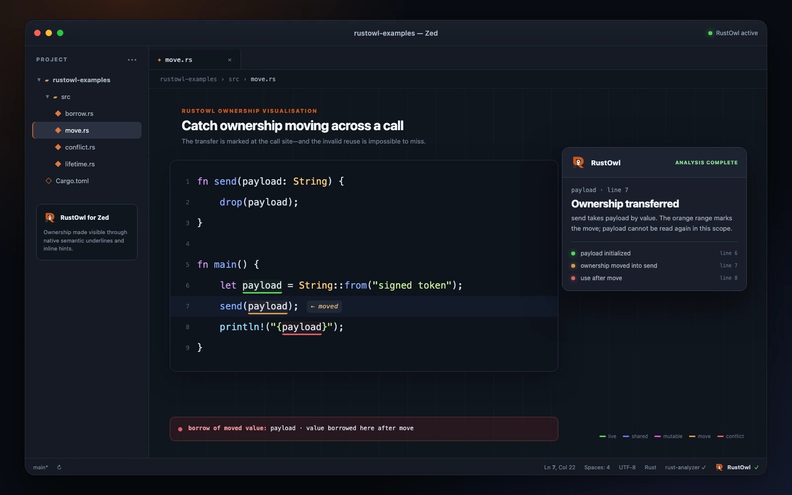
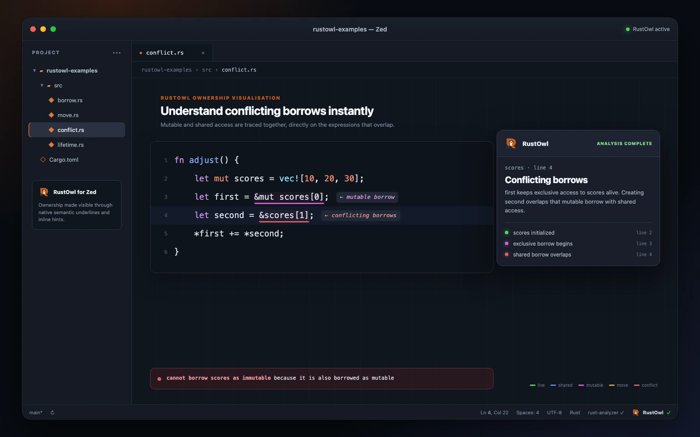
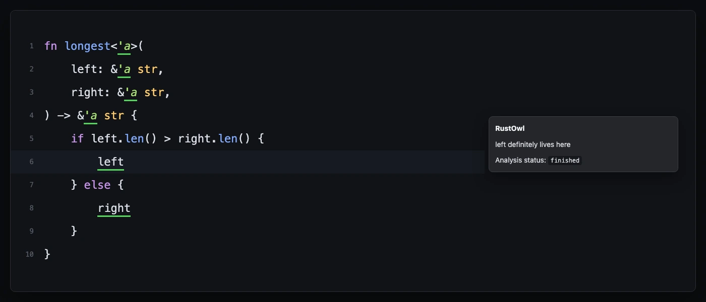

<p align="center">
  
</p>

# RustOwl for Zed

An unofficial Zed client for
[RustOwl](https://github.com/cordx56/rustowl), built with care by
[RustyAuth](https://rustyauth.dev).

RustOwl makes Rust ownership and lifetimes visible. Hover a variable or
function call and this extension asks RustOwl to analyse the selected value,
then renders its lifetime, borrows, moves, calls, and lifetime errors as
coloured underlines and inline helper labels in Zed.

> [!IMPORTANT]
> This project is an independent Zed integration. RustOwl was created by
> [Kota Mori (`cordx56`)](https://github.com/cordx56), who deserves the credit
> for the compiler analysis, LSP server, visual language, and original editor
> integrations. This repository is not an official RustOwl project.

## Status

The client is under active development ahead of its first Zed Extension
Marketplace submission. The adapter and extension build in CI; hands-on Zed
testing and upstream feedback are the remaining gates before submission.

## What it looks like

Faithful previews of the current adapter output: Zed's native LSP hover popover,
semantic-token underlines, and inlay hints. Exact colours follow your Zed theme.

**Immutable borrowing**

<a href="assets/showcase/borrow.webp"></a>

**Ownership moves**

<a href="assets/showcase/move.webp"></a>

**Conflicting borrows**

<a href="assets/showcase/conflict.webp"></a>

**Lifetime relationships**

<a href="assets/showcase/lifetime.webp"></a>

## Install

Once the extension is published, open Zed's Extensions view and search for
**RustOwl**. During development, clone this repository and use **Install Dev
Extension** from Zed's Extensions view.

The extension automatically downloads:

- the adapter released from this repository; and
- an unmodified RustOwl binary from the
  [official RustOwl releases](https://github.com/cordx56/rustowl/releases).

On its first managed launch, the adapter also asks RustOwl to install the
matching Rust compiler components it requires. This is a one-time, potentially
large download performed by RustOwl's own toolchain installer; subsequent
starts reuse it.

If `rustowl` or `rustowl-zed-adapter` is already on your `PATH`, the extension
uses it instead. A `rustowl` supplied on `PATH` remains under your control, so
its upstream toolchain should already be installed.

## Configure Zed

RustOwl runs alongside `rust-analyzer`. Add `rustowl` to the Rust language
servers and enable semantic tokens:

```jsonc
{
  "languages": {
    "Rust": {
      "language_servers": ["rust-analyzer", "rustowl", "..."],
      "semantic_tokens": "combined"
    }
  },
  "inlay_hints": {
    "enabled": true,
    "show_other_hints": true
  },
  "global_lsp_settings": {
    "semantic_token_rules": [
      {
        "token_type": "rustowlDefinitelyLive",
        "underline": "#52d65b"
      },
      {
        "token_type": "rustowlMaybeInitialized",
        "underline": "#52d65b"
      },
      {
        "token_type": "rustowlImmutableBorrow",
        "underline": "#647cf3"
      },
      {
        "token_type": "rustowlMutableBorrow",
        "underline": "#d65bd1"
      },
      {
        "token_type": "rustowlMoveOrCall",
        "underline": "#d69852"
      },
      {
        "token_type": "rustowlOutlive",
        "underline": "#d65252"
      }
    ]
  }
}
```

The colours follow RustOwl's visual vocabulary:

- green — definitely live or maybe initialized;
- blue — immutable borrow;
- purple — mutable borrow;
- orange — move or function call; and
- red — outlive or conflicting-borrow error.

You may replace the colours with any hex values supported by Zed.

With inlay hints enabled, ownership events also receive subtle inline helpers
such as `← immutable borrow`, `← moved`, and `← conflicting borrows`. These are
standard Zed inlay hints, so they inherit the active theme and can be toggled
from Zed's editor controls.

## How it works

RustOwl exposes ownership information through the custom `rustowl/cursor` LSP
request. Zed can launch language servers but its extension API does not yet let
extensions send arbitrary LSP requests or draw arbitrary editor decorations.

The `rustowl-zed-adapter` executable bridges that gap:

1. Zed sends a standard hover request to the adapter.
2. The adapter translates it to `rustowl/cursor`.
3. RustOwl returns typed source ranges.
4. The adapter exposes those ranges as standard semantic tokens and inlay
   hints, then asks Zed to refresh them.

The adapter also turns each save notification into `rustowl/analyze`, matching
the behaviour of RustOwl's official editor clients.

## Current limitations

- Visualisation is triggered by hover rather than by an idle text cursor.
- Zed semantic tokens must be enabled and styled as shown above; inline helper
  labels additionally require inlay hints.
- Zed currently supports coloured semantic-token underlines, but not
  RustOwl's distinction between solid and wavy underline styles.
- The first analysis of a Cargo workspace can take time, just as it does in
  RustOwl's other editor integrations.
- A fresh managed install must download RustOwl's matching compiler toolchain
  before the language server can start.

## Develop

Requirements:

- a current stable Rust toolchain;
- the `wasm32-wasip2` target for the Zed extension; and
- RustOwl on `PATH` for an end-to-end local run.

```sh
rustup target add wasm32-wasip2
cargo check --target wasm32-wasip2
cargo test --manifest-path adapter/Cargo.toml
cargo clippy --manifest-path adapter/Cargo.toml --all-targets -- -D warnings
cargo build --manifest-path adapter/Cargo.toml
node scripts/smoke.mjs /path/to/rustowl
```

The last two commands run the optional end-to-end smoke fixture against a real
RustOwl installation and verify both semantic-token underlines and inline
hints.

Release tags build adapter archives for macOS, Linux, and Windows on x86-64
and ARM64. The Zed extension downloads the archive matching the host platform.

## A small love letter from RustyAuth

[RustyAuth](https://github.com/rusty-auth/rustyauth) is passkey-first
authentication built in Rust. We care about tools that make Rust's guarantees
easier to see, learn, and trust. This integration is our thank-you to RustOwl
and to the wider Rust community.

## Attribution and licensing

The extension and adapter in this repository are independently written and
licensed under the [MIT License](LICENSE), one of the licences accepted by the
Zed Extension Marketplace.

RustOwl is a separate project licensed under the Mozilla Public License 2.0.
The extension downloads official, unmodified RustOwl release artifacts at
runtime; it does not bundle or relicense RustOwl. See
[THIRD_PARTY_NOTICES.md](THIRD_PARTY_NOTICES.md) for details.
