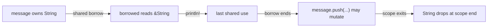
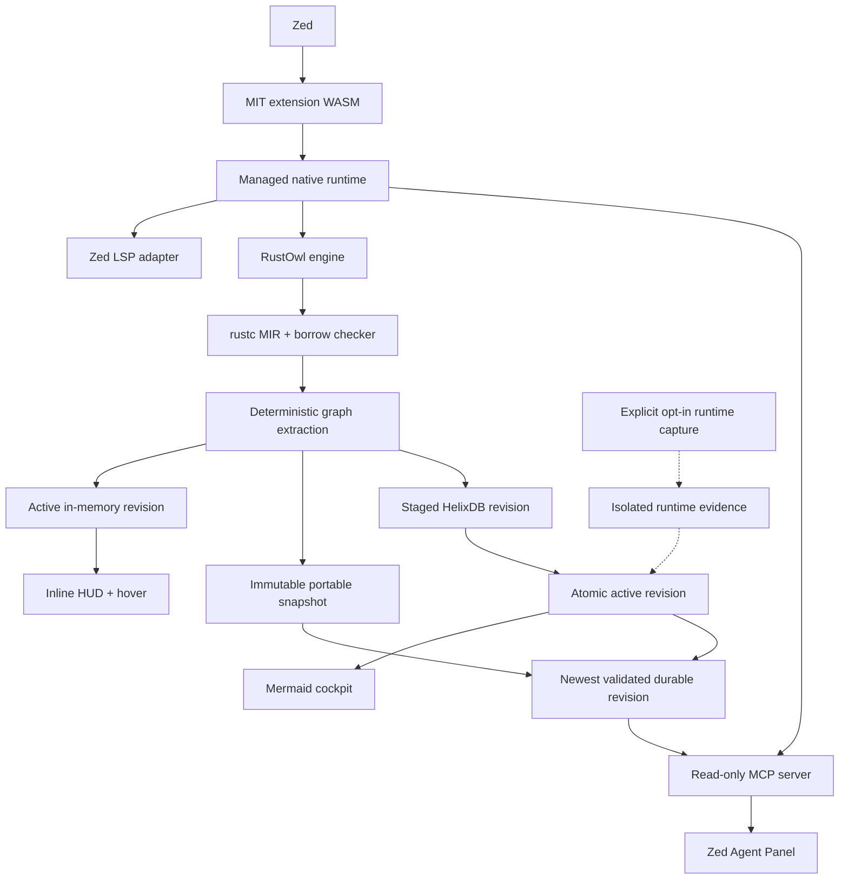

<p align="center">
  
</p>

# RustOwl for Zed

<p align="center">
  <strong>See what Rust's borrow checker sees.</strong><br>
  Compiler-grounded ownership intelligence for developers and coding agents.
</p>

Rust gives developers memory safety without a garbage collector, but the
ownership decisions that make it possible are normally invisible. You are
left reconstructing moves, borrows, permissions, lifetimes, drops, and async
suspension state in your head.

**RustOwl turns that hidden compiler model into a live ownership cockpit inside
Zed.** It explains what happened beside the code, reveals why it happened on
hover, traces where the value came from and where it goes next, and gives
coding agents access to the same revisioned evidence.

> **Stop guessing where ownership went. See the move, the borrow, the lifetime,
> and the consequence where they happen.**

[See it in Zed](#see-it-in-zed) ·
[Explore the architecture](#architecture) ·
[Give agents ownership context](#give-zeds-agent-panel-compiler-context) ·
[Install locally](#install-in-zed) ·
[Read the roadmap](docs/ownership-cockpit-roadmap.md)

This is an independent Zed integration built by
[RustyAuth](https://rustyauth.dev). It combines a maintained RustOwl compiler
engine, a Zed-native LSP adapter, a persistent workspace graph powered by
embedded HelixDB, and a read-only MCP interface for agentic tooling.

> [!IMPORTANT]
> [RustOwl](https://github.com/cordx56/rustowl) was created by
> [Kota Mori (`cordx56`)](https://github.com/cordx56). Kota deserves the credit
> for the compiler analysis, LSP server, visual language, and original editor
> integrations. This repository is not an official RustOwl project. Our
> maintained engine fork preserves the original history, attribution, and
> MPL-2.0 licence.

## Rust's superpower should not be invisible

The Rust compiler already understands the questions that consume so much
debugging time:

- Why can I not mutate this value yet?
- Where did ownership leave this scope?
- Which reference keeps this allocation alive?
- What is stored inside this future across `.await`?
- Which call in a six-function chain moved, reborrowed, returned, or dropped
  the value?
- Is this fact compiler-proven, path-dependent, stale, or outside the current
  analysis boundary?

RustOwl brings those answers into the editing loop. The fast path stays quiet:
compact inline signals show what matters. Hovering opens a short source-level
explanation of the consequence, likely fix, and ownership flow. Exact compiler
structure remains available through bounded graph and agent queries instead of
crowding the editor with rustc internals.

## One compiler truth. Three audiences.

| If you are… | RustOwl gives you… |
| --- | --- |
| **Learning Rust** | Plain-language answers to “who owns this?”, “who may read or write it?”, and “when does the borrow end?” without replacing the real compiler model with a metaphor. |
| **Shipping production Rust** | Exact MIR-grounded evidence, certainty, source locations, interprocedural flow, async suspension context, and compact provenance for difficult investigations. |
| **Pairing with a coding agent** | Read-only access to the same fresh workspace revision through MCP, so the agent can inspect ownership facts instead of inferring them from syntax alone. |

The learner and the senior engineer do not need separate tools. They need
**progressive disclosure over the same truth**: consequence first, compiler
evidence when requested, and a deeper graph when the local answer is not
enough.

## One ownership model. Four connected surfaces.

| Surface | Experience |
| --- | --- |
| **Inline HUD** | Quiet move, borrow, mutation, liveness, drop, and async hints beside the relevant code. |
| **Native hover** | A compact source-level event, consequence or fix, ownership flow, and freshness/certainty status. |
| **Workspace cockpit** | Whole-workspace call chains, ownership flows, async state, Mermaid diagrams, and eventually opt-in runtime overlays. |
| **Agent context** | The same revisioned, bounded evidence through six MCP tools and three task-focused prompts. |

This is not four separate interpretations. The editor, graph, diagrams, and
agent tools all read from the same versioned evidence model. Mermaid and
Markdown are renderers, never the source of semantic truth.

## More than another tooltip

RustOwl is deliberately complementary to `rust-analyzer`:

- **`rust-analyzer` tells you what the code is. RustOwl explains what ownership
  is doing.**
- **Compiler facts, not syntax guesses.** Moves, borrows, liveness, drops, and
  control-flow events originate in rustc/MIR analysis.
- **A graph, not a pile of annotations.** Local events connect into
  cross-function ownership and async paths.
- **One context for humans and agents.** An agent can query the same revision
  and evidence boundary visible in the editor.
- **Local-first by design.** Static ownership evidence is stored in an embedded
  HelixDB graph; no cloud index or database daemon is required.
- **Honest uncertainty.** Compiler-proven, derived, conservative, unavailable,
  and stale evidence remain visibly distinct.

RustOwl does not replace or fork Zed's native Rust language server. It runs
beside `rust-analyzer`, adding the ownership-intelligence layer the language
server was not designed to expose.

## A development cockpit, not just diagnostics

Traditional diagnostics answer after something has gone wrong. RustOwl is
designed to make ownership continuously legible while code is being written,
reviewed, refactored, and debugged:

- follow a value across calls, returns, reborrows, mutations, and drops;
- inspect field projections and partial moves without flattening them into the
  parent value;
- understand what an async future retains at each suspension point;
- expose cancellation and drop boundaries that are easy to miss in async code;
- render a bounded ownership or memory-state diagram from compiler evidence;
- preserve the exact source span, certainty, graph revision, and provenance
  behind every explanation; and
- let an agent answer ownership questions against indexed evidence rather than
  a probabilistic reading of the source.

That shared evidence layer is the foundation for a deeper Rust engineering
cockpit: source-local guidance when the answer is small, visual flow when it is
structural, and agent tools when the investigation crosses the workspace.

## Verified release evidence

The current `0.1.3` marketplace candidate is backed by executable gates rather
than screenshots alone:

| Gate | Verified result |
| --- | --- |
| **Live Zed Preview** | RustOwl underlines, inline hints, and layered hovers run beside `rust-analyzer` in a real editor session. |
| **Native release matrix** | Release automation builds, launches, and verifies checksummed runtimes for macOS, Windows, and Linux on ARM64 and x86_64. |
| **Exact compiler artifact** | Source-to-graph tests prove resolved calls, parameters, returns, generics, trait dispatch, closure captures, and exact rustc coroutine-layout fields. |
| **Rapid-edit safety** | A repeated v1 → cancelled-v2 → v3 test proves the editor, portable snapshot, Helix, and a fresh MCP process converge on v3. |
| **Injected persistence failure** | With Helix disabled, editor visuals remain live and a separate agent process reads the immutable portable snapshot. |
| **Supply-chain verification** | Archive contents, manifests, checksums, SBOMs, licences, and binary formats are checked before publication; the extension verifies extracted checksums and schema before execution. |
| **Evidence integrity** | Indexed and agent responses carry revision, schema, document version, freshness, certainty, bounds, and omission metadata; compact hovers state their evidence status without exposing internal IDs. |

See the repository's current
[main CI evidence](https://github.com/rusty-auth/rustowl-zed/actions/workflows/ci.yml)
and
[six-target release verification](https://github.com/rusty-auth/rustowl-zed/actions/workflows/release.yml).

## Release candidate status

RustOwl for Zed `0.1.3` is a marketplace candidate under active hardening. The
extension, indexed compiler engine, embedded HelixDB store, and MCP server have
been exercised together in Zed Preview on macOS ARM64 with `rust-analyzer`
running alongside RustOwl.

The repository is not yet claiming public marketplace publication.
Cross-platform visual, stress, and performance checks plus the tagged release
remain gates before submission. Optional runtime-value capture remains a
deliberately separate future capability: this release exposes static compiler
evidence and never claims to have observed program execution.

- [Production roadmap](docs/ownership-cockpit-roadmap.md)
- [Engine architecture](docs/engine-architecture.md)
- [Marketplace release checklist](docs/marketplace-submission.md)
- [Maintained RustOwl engine fork](https://github.com/rusty-auth/rustowl-engine)

## See it in Zed

These are faithful previews of the current adapter output: ownership
explanations in Zed's native LSP hover popover, semantic-token underlines, and
inlay hints. The showcases use a warm Gruvbox-inspired palette chosen to
complement RustyAuth; popover and hint chrome follow the active Zed theme.

Each compact hover names the source-level event, explains the consequence or
fix, and shows the shortest useful flow. It ends with an honest evidence
status. Internal MIR places, revision metadata, larger traces, and exact
omission counts remain available to experienced engineers and agents through
the graph tools, where they do not compete with Zed's own documentation hover.

Generic analysis boundaries and compiler-generated function-signature events
do not outrank useful ownership facts. When evidence is conservative or
unresolved, the hover says so instead of presenting a guess as a Rust error.

**Immutable borrowing**

<a href="assets/showcase/zed-rich-borrow.webp"></a>

**Ownership-sensitive calls**

<a href="assets/showcase/zed-rich-move.webp"></a>

**Conflicting borrows**

<a href="assets/showcase/zed-rich-conflict.webp"></a>

**Lifetime relationships**

<a href="assets/showcase/zed-rich-lifetime.webp"></a>

## Inside the ownership-intelligence platform

### A temporal ownership graph for the whole Cargo workspace

The maintained engine converts cursor-oriented RustOwl reports and MIR into a
deterministic graph covering analyzed crates, modules, files, functions,
bindings, MIR places, calls, borrows, moves, mutations, returns, drops,
control-flow blocks, suspension points, and diagnostics.

Every semantically changed compiler analysis produces an immutable revision;
an unchanged restart reuses the active revision. Editor and agent responses
identify the revision and source fingerprint they came from. The previous
complete revision remains available while new compiler work runs; cancelled
or incomplete analysis is never activated.

The graph contract connects:

- direct calls, receivers, arguments, parameters, and returned places;
- field projections and partial moves;
- shared and mutable borrows, reborrows, aliasing, and mutation-through-reference;
- generic and statically resolved trait calls;
- closures and captured places;
- async-generated state, suspension, resume, and cancellation boundaries; and
- conservative or unresolved boundaries for dynamic dispatch, macros, FFI,
  raw pointers, and unsafe code.

HelixDB is embedded behind an engine-owned storage interface. The editor's hot
path remains in memory. Every valid editor revision is also written atomically
to a small bounded portable snapshot, so a separate agent process still works
when Helix is disabled, locked, missing, or corrupt. Helix publication is
serialized and sequence-checked; readers compare both durable sources and use
the newest validated revision. Users do not need Docker, a database daemon, a
cloud account, or a Helix service.

### Follow ownership across functions and async state

The cockpit and agent tools answer questions that a single-line tooltip cannot:

- Where did this value originate and where is ownership transferred?
- Which borrow remains active across this call or `.await`?
- What is retained inside the generated future?
- Why might a future fail `Send` or `'static` requirements?
- Which callers are affected if a parameter changes from borrowed to owned?
- Where is a value mutated through several layers of references?
- At which possible points is the value returned, cancelled, or dropped?

Cross-function fidelity is delivered in tested levels. A graph query stops at
an unresolved boundary unless conservative expansion is explicitly requested.
Storage or rendering is never allowed to invent a missing ownership edge.

### Turn compiler evidence into visual flow

When a local hover is too small for the question, cockpit queries turn the same
compiler evidence into bounded graph slices and Mermaid maps. Current graph
views cover:

- selected-value ownership flow;
- function memory and ownership state machines;
- caller/callee transfer paths;
- async suspension and cancellation state;
- borrow-conflict control-flow branches;
- workspace ownership summaries; and
- source-backed, agent-guided ownership tours.

A compact trace can turn an invisible non-lexical lifetime into a map a human
or agent can reason about:



RustOwl does not write generated cockpit files into the tracked source tree.
Until Zed exposes custom extension panes, these views can be rendered beside
the source or directly inside an agent response rather than on a bespoke,
always-on canvas.

### Give Zed's Agent Panel compiler context

The extension registers the local `rustowl-ownership` stdio context server
alongside its language server. The managed runtime supplies `rustowl-mcp`,
allowing enabled Zed Agent Profiles to query the active ownership revision.
The LSP process is the only graph writer; MCP compares the activated Helix
revision with the newest portable snapshot and opens the newer validated
artifact as a bounded, read-only consumer. A short-lived worktree registry
removes the startup race when Zed launches the Agent Panel before compiler
indexing has registered every project root.

The tool surface is deliberately focused:

| MCP tool | Purpose |
| --- | --- |
| `rustowl_workspace_summary` | Summarize active revisions, graph kinds, certainty counts, and freshness. |
| `rustowl_inspect_range` | Inspect bounded ownership, borrow, lifetime, control-flow, and async evidence at source lines. |
| `rustowl_trace_ownership` | Traverse a value forward or backward through calls, moves, borrows, returns, awaits, and drops. |
| `rustowl_render_mermaid` | Render a previously returned graph reference as bounded Mermaid source. |
| `rustowl_search` | Find bindings, places, functions, events, and diagnostics by source/compiler label. |
| `rustowl_async_state` | Explain retained future state, suspension, resume, and cancellation/drop relationships. |

Three audience-aware prompts guide agents through ownership debugging,
async-state analysis, and ownership-preserving refactors:
`debug-rust-ownership`, `explain-rust-async-state`, and
`plan-rust-ownership-refactor`.

With those tools enabled, an agent can answer questions such as:

- “Trace this token from construction through every borrow, call, and drop.”
- “Show what this future retains across each `.await` and where cancellation
  releases it.”
- “Render the smallest ownership diagram that explains this conflict.”
- “Plan a borrowed-to-owned API refactor and identify the affected callers.”
- “Separate the compiler-proven path from unresolved dispatch or unsafe
  boundaries.”

The result is a materially better pairing loop: the model can cite exact spans,
graph nodes, certainty, and revision freshness instead of producing a plausible
ownership narrative from source text alone.

Agent responses are bounded and include exact workspace-relative spans,
freshness, compiler and engine versions, certainty, truncation, and omitted
counts. No agent tool can write the graph, launch compiler work, edit source,
or execute the user's program.

### Pair static ownership with opt-in runtime evidence

Static ownership semantics and observed runtime execution are different kinds
of truth. A later, explicitly opt-in lane will correlate compiler-assigned
graph IDs with instrumented runtime events without relabelling static
possibilities as executed paths.

The first capture policy records control flow and event identity rather than
arbitrary values. More detailed metadata or approved values requires an
escalating user-selected policy, redaction, byte limits, retention controls,
and local encryption. Agents cannot start capture, silently execute code, or
read arbitrary memory.

This lane is intended to show which statically described calls, mutations,
returns, drops, tasks, and suspension events were observed in one selected run.
One run never proves that other possible paths are unreachable.

## Compiler truth, without false certainty

Every editor, diagram, and agent surface follows one shared truth contract:

- **compiler-proven** — derived directly from rustc, MIR, or borrow-checker facts;
- **source-resolved** — connected by an identified source-level resolver;
- **conservative** — a bounded over-approximation rendered using “may” language;
- **unresolved** — an observed event whose remote endpoint is unknown; and
- **observed-in-run** — optional runtime evidence tied to one build and run.

The static graph describes possible program semantics, not runtime values or
the branch a program actually executed. Stale facts always identify their
completed revision and never masquerade as analysis of unsaved code.

“Live” initially means responsive presentation of the latest complete
revision, immediate invalidation of affected regions, and atomic replacement
after save or a bounded idle debounce—not a full rustc-quality workspace build
on every keystroke.

## Architecture



Release archives contain the adapter, RustOwl engine, compiler wrapper,
licences, notices, manifest, checksums, and software bill of materials. The
same engine version serves LSP and MCP modes so graph schema and protocol
versions cannot drift.

## Install in Zed

Once published, open Zed's Extensions view and search for **RustOwl**. During
development, clone this repository and use **Install Dev Extension** from
Zed's Extensions view.

The extension downloads one target-specific runtime archive from this
repository. It contains the Zed adapter, maintained RustOwl engine, compiler
wrapper, MCP server, manifest, checksums, and the required MIT, MPL-2.0, and
Apache-2.0 notices. The extension verifies the compatibility manifest and every
checksummed file before making any native binary executable.

On its first managed launch, the adapter asks RustOwl to install the matching
Rust compiler components. This is a one-time, potentially large download
performed by RustOwl's toolchain installer; subsequent starts reuse it.

Development settings may point the `rustowl` language server at a local adapter
and engine. A user-supplied engine remains under the user's control and should
already have its matching compiler toolchain installed.

## Configure Zed

RustOwl runs alongside `rust-analyzer`. Add `rustowl` to the Rust language
servers and enable semantic tokens and inlay hints:

```jsonc
{
  "languages": {
    "Rust": {
      "language_servers": ["rust-analyzer", "rustowl", "..."],
      "semantic_tokens": "combined"
    }
  },
  "inlay_hints": {
    "enabled": true,
    "show_other_hints": true
  },
  "global_lsp_settings": {
    "semantic_token_rules": [
      {
        "token_type": "rustowlDefinitelyLive",
        "underline": "#52d65b"
      },
      {
        "token_type": "rustowlMaybeInitialized",
        "underline": "#52d65b"
      },
      {
        "token_type": "rustowlImmutableBorrow",
        "underline": "#647cf3"
      },
      {
        "token_type": "rustowlMutableBorrow",
        "underline": "#d65bd1"
      },
      {
        "token_type": "rustowlMoveOrCall",
        "underline": "#d69852"
      },
      {
        "token_type": "rustowlOutlive",
        "underline": "#d65252"
      }
    ]
  }
}
```

The colours follow RustOwl's visual vocabulary:

- green — definitely live or maybe initialized;
- blue — immutable borrow;
- purple — mutable borrow;
- orange — move or ownership-sensitive function call; and
- red — outlive or conflicting-borrow error.

After a save, ownership events in visible code receive compact helpers such as
`← shared borrow · read-only`, `← move / call · check ownership`, and
`← borrow conflict · shared + mutable`. When several events occur on one line,
the adapter shows the most useful one inline and keeps the complete set in the
hover.

The extension also exposes the `rustowl-ownership` context server. Enable its
tools for the desired Zed Agent Profile; enabling a tool permits its bounded
response to be sent to the model provider selected by the user. The server
does not receive unsaved buffers and has no write or execution tools.

## How the adapter works

The maintained engine exposes indexed `rustowl/inspectRange`,
`rustowl/ownershipGraph`, `rustowl/workspaceMap`, and
`rustowl/analysisStatus` requests plus `rustowl/analysisUpdated`. The original
`rustowl/cursor` request remains as a compatibility fallback. Zed can launch
language servers, but its extension API does not let an extension draw
arbitrary editor decorations, so the adapter translates graph evidence into
standard LSP features.

The `rustowl-zed-adapter` bridges that gap:

1. Opening a Rust document triggers workspace indexing; a save requests a new
   complete compiler revision.
2. The adapter prefetches indexed graph evidence for open documents and reacts
   to revision-update notifications.
3. Zed requests standard semantic tokens, inlay hints, or hover content.
4. The adapter exposes the compiler ranges as semantic tokens, compact
   inlay hints, and Markdown hovers.
5. Hover may request a narrower graph slice for detail, but it is never required
   to activate inline visuals.

Unsaved changes invalidate affected compiler evidence immediately. Zed keeps
ordinary rust-analyzer feedback, while RustOwl resumes from the latest complete
saved revision after the next analysis finishes.

## Privacy, reliability, and performance

- Analysis, indexing, graph storage, and diagram generation are local by default.
- No source, graph, telemetry, or credentials are uploaded by RustOwl.
- MCP only returns data after a user enables and invokes a tool through an agent.
- Workspace-relative paths and bounded query budgets prevent arbitrary file access.
- The LSP is the single graph writer; MCP opens the newest validated durable revision read-only.
- Atomic activation preserves the previous valid revision after cancellation or a crash.
- A missing, locked, corrupt, or disabled Helix index falls back to a bounded immutable portable snapshot for separate agent processes; editor reads remain in memory.
- Managed downloads are checksum- and manifest-verified before any native binary executes.
- Generated Mermaid labels are escaped before rendering.
- Release artifacts carry licences, notices, checksums, and an SBOM.

Post-analysis performance gates target cached hovers below 30 ms p95,
visible-range queries below 50 ms p95, six-hop ownership traces below 100 ms
p95, and MCP workspace summaries below 200 ms p95. These are release criteria,
not claims about the current prototype.

## Delivery status

| Milestone | Outcome |
| --- | --- |
| **M0 — Contracts** | Implemented: stable graph IDs, certainty model, ADRs, fixtures, and benchmark harness. |
| **M1 — In-memory graph** | Implemented: deterministic extraction and bounded range, trace, and map queries. |
| **M2 — Indexed LSP** | Implemented: range/graph/map/status methods, freshness enforcement, and update notifications. |
| **M3 — HelixDB persistence** | Implemented: embedded native records, serialized sequence-safe activation, recovery, in-memory editor reads, and immutable portable agent fallback. |
| **M4 — Zed cockpit** | Implemented: proactive inline HUD, layered hovers, async helpers, and Mermaid rendering through the shared graph. |
| **M5 — Agent Panel** | Implemented: six read-only MCP tools, three audience-aware prompts, context-server registration, bounded output, and protocol smoke tests. |
| **M6 — Runtime evidence** | Future, opt-in lane; intentionally excluded from the static-analysis release. |
| **M7 — Unified runtime** | Implemented in release automation: six target archives, compatibility manifest, checksums, licences, notices, upgrade, and rollback. |
| **M8 — Beta hardening** | In progress: local macOS live-editor, compiler-artifact, rapid-edit race, injected-failure, bounded MCP, and six-platform packaging gates pass; cross-platform visual and performance characterization remain. |
| **M9 — Marketplace GA** | Pending the tagged runtime matrix and upstream Zed extensions-repository review. |

Read the [complete roadmap](docs/ownership-cockpit-roadmap.md) for graph schema,
protocol contracts, performance objectives, security gates, and milestone exit
criteria.

## Current limitations

- Automatic visuals are based on saved compiler analysis; unsaved edits invalidate stale
  ownership ranges until the next complete revision.
- Zed semantic tokens must be enabled and styled; inline helpers additionally
  require inlay hints.
- Zed supports coloured semantic-token underlines but not every solid/wavy
  distinction used by RustOwl's other clients.
- The first Cargo-workspace analysis and managed compiler-toolchain download can
  take time.
- Zed does not currently expose a custom extension-pane API, so detailed visual
  traces are returned as structured data and Mermaid rather than a bespoke
  always-on canvas.
- Dynamic dispatch, FFI, raw pointers, macros, and unsupported MIR remain
  explicitly conservative or unresolved instead of being guessed.
- Runtime values and actually executed paths are not captured. The optional
  runtime-evidence design remains separate and opt-in.

## Develop

Requirements:

- a current stable Rust toolchain for the extension and adapter;
- the `wasm32-wasip2` target;
- the engine fork's pinned Rust toolchain for compiler work; and
- the maintained engine submodule.

Clone the maintained engine fork and configure the original project as its
`upstream` remote:

```sh
git submodule update --init --recursive
./scripts/setup-engine-remotes.sh
```

Build and test the current extension and adapter:

```sh
rustup target add wasm32-wasip2
cargo check --target wasm32-wasip2
cargo test
cargo test --manifest-path adapter/Cargo.toml
cargo clippy --manifest-path adapter/Cargo.toml --all-targets -- -D warnings
cargo build --manifest-path adapter/Cargo.toml
node scripts/memory-fallback-smoke.mjs
node scripts/rapid-edit-smoke.mjs
```

Build and test the maintained compiler engine separately:

```sh
cd engine
cargo test
cargo clippy --all-targets -- -D warnings
cargo build --bins
cd ..
RUSTOWL_AUTO_SETUP=0 \
RUSTOWLC="$PWD/engine/target/debug/rustowlc" \
RUSTOWLC_WORKSPACE_WRAPPER="$PWD/engine/target/debug/rustowlc" \
node scripts/compiler-graph-smoke.mjs "$PWD/engine/target/debug/rustowl"
```

The Node smoke fixture is only a local protocol harness; production release
gates also require a clean installation and visual verification in the real
Zed editor on every supported platform.

## Prior art and collaboration

The graph design is being compared with
[Place Capability Graphs](https://github.com/prusti/pcg) before schema version
1 is frozen. [Flowistry](https://github.com/willcrichton/flowistry) informs
modular information-flow summaries. Aquascope, RustViz, BORIS, OwnSight, and
mind-expander inform visual language and agent navigation.

These projects are a design and validation corpus, not unreviewed production
dependencies. Source enters the product only through a separately reviewed,
licence-compatible dependency or an independent implementation of a published
interface. Generally useful RustOwl protocol improvements should be proposed
upstream.

## A small love letter from RustyAuth

[RustyAuth](https://github.com/rusty-auth/rustyauth) is passkey-first
authentication built in Rust. We care about tools that make Rust's guarantees
easier to see, learn, and trust. This project is our thank-you to RustOwl and
to the wider Rust community.

## Attribution and licensing

The Zed extension and adapter are independently written and licensed under the
[MIT License](LICENSE), one of the licences accepted by the Zed Extension
Marketplace.

RustOwl is licensed under the Mozilla Public License 2.0. Its source is pinned
in the [`engine`](engine) Git submodule from the RustyAuth-maintained fork,
with the original repository retained as `upstream`. MPL-covered engine files
remain MPL-2.0 and are not relicensed by this repository.

HelixDB is linked from the immutable revision recorded in
[`engine/Cargo.lock`](engine/Cargo.lock) and mirrored as the
[`references/helix-db`](references/helix-db) submodule under Apache-2.0. See
[THIRD_PARTY_NOTICES.md](THIRD_PARTY_NOTICES.md) for attribution, provenance,
and distribution obligations.
