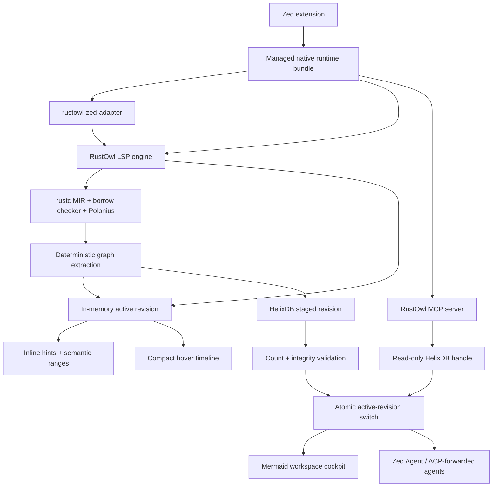
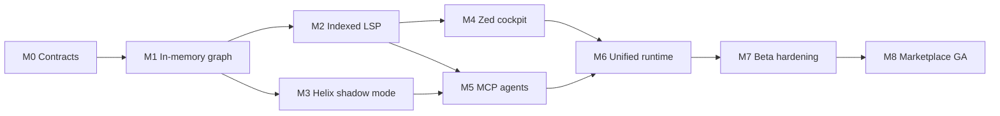

# RustOwl ownership cockpit roadmap

## Vision

RustOwl should become a compiler-grounded ownership cockpit for an entire Rust
workspace. It should explain the selected line immediately, trace ownership
through functions and asynchronous suspension points, render navigable flow
maps, and give editor agents the same structured facts through MCP.

The source of truth remains Rust compiler analysis. HelixDB stores and queries
the resulting graph; it does not infer Rust semantics.

The product has four connected surfaces:

1. **Inline HUD** — one high-signal ownership hint per visible line.
2. **Native hover** — a compact explanation and short ownership timeline.
3. **Workspace cockpit** — detailed Mermaid and structured graph views opened
   beside the source file.
4. **Agent context** — bounded MCP tools and prompts available in Zed's Agent
   Panel.

## Product principles

- Compiler-proven facts must be distinguishable from source-level inference.
- The last complete revision remains available while a new analysis runs.
- A missing, locked, incompatible, or corrupt index cannot break highlighting.
- Editor latency must not depend on persistence or object storage.
- All indexing is local by default. No source, graph, or telemetry is uploaded.
- Agent tools return the smallest useful subgraph and always report freshness.
- The engine emits structured data. Mermaid and Markdown are renderers.
- Upstream RustOwl attribution, history, and MPL-2.0 requirements remain intact.

## Target architecture



The LSP process is the only graph writer. The MCP process opens the same
workspace database read-only. Both can serve the last complete revision. The
LSP keeps a bounded in-memory representation of the active and currently
visible subgraphs so common editor requests do not touch the database.

## Runtime packaging

The extension WASM remains a small installer and launcher. Each platform
release contains one native runtime archive:

```text
rustowl-zed-runtime-<target>/
├── rustowl-zed-adapter[.exe]
├── rustowl[.exe]
├── rustowlc[.exe]
├── LICENSE-MIT
├── LICENSE-MPL-2.0
├── LICENSE-APACHE-2.0
├── THIRD_PARTY_NOTICES.md
├── manifest.json
└── checksums.sha256
```

HelixDB is linked into `rustowl`; users do not install Docker, start a daemon,
create a cloud account, or configure a database URL. The same `rustowl` binary
can run either `lsp` or `mcp` mode so engine, schema, and protocol versions
cannot drift.

The extension registers both capabilities:

```toml
[language_servers.rustowl]
name = "RustOwl"
languages = ["Rust"]

[context_servers.rustowl]
```

`language_server_command` launches the adapter. `context_server_command`
launches `rustowl mcp` from the same runtime directory and supplies the shared
graph root.

Release jobs build and smoke-test all currently supported targets:

- `aarch64-apple-darwin`
- `x86_64-apple-darwin`
- `aarch64-unknown-linux-gnu`
- `x86_64-unknown-linux-gnu`
- `aarch64-pc-windows-msvc`
- `x86_64-pc-windows-msvc`

## Workspace identity and storage

The runtime receives a stable extension work directory. Each workspace is
stored below a key derived from its canonical Cargo root, toolchain, target,
enabled features, and schema major version:

```text
<extension-work>/graph/
└── <workspace-key>/
    ├── active.json
    ├── helix/
    ├── locks/
    ├── revisions/
    └── recovery/
```

Paths stored in graph properties are workspace-relative whenever possible.
Dependency source is indexed only when the user enables it. Build output,
generated files, and source outside configured roots are excluded by default.

`active.json` is a small recovery manifest containing schema version, active
revision, source fingerprint, engine version, toolchain, completion time, and
integrity counts. It is written atomically after the Helix revision validates.

## Revision model

Every completed compiler analysis creates an immutable `AnalysisRevision`:

```text
revision_id
workspace_key
document_versions
source_fingerprint
compiler_version
engine_version
schema_version
started_at
completed_at
status
node_count
edge_count
diagnostic_count
```

The indexer follows this sequence:

1. Cancel obsolete compiler and index work.
2. Analyze the affected Cargo workspace or package.
3. Convert all completed crate results into a deterministic graph snapshot.
4. Validate local IDs, source spans, edge endpoints, and graph invariants.
5. Publish the in-memory snapshot for editor reads.
6. Write a new staged Helix revision in batches.
7. Validate persisted counts and sample traversals.
8. Atomically mark the revision active.
9. Notify LSP and MCP consumers of the new revision.
10. Retain the previous complete revision until compaction succeeds.

Cancelled, incomplete, or invalid revisions are never activated. Startup
recovers the newest valid complete revision and quarantines abandoned staging
data.

## Ownership graph schema

### Nodes

- `Workspace`
- `Crate`
- `Module`
- `SourceFile`
- `Function`
- `Binding`
- `Place`
- `CallSite`
- `BorrowEvent`
- `MoveEvent`
- `MutationEvent`
- `ReturnEvent`
- `DropEvent`
- `SuspensionPoint`
- `ControlBlock`
- `Diagnostic`
- `AnalysisRevision`

Every semantic node contains a stable external ID, revision ID, source span,
workspace-relative file, compiler identity where available, and certainty.
Event nodes also contain ordering, control-flow block, human label, and the
underlying RustOwl report.

### Edges

- `CONTAINS`
- `DECLARES`
- `OWNS`
- `CALLS`
- `PASSES_TO`
- `MOVES_TO`
- `COPIES_TO`
- `BORROWS_SHARED`
- `BORROWS_MUT`
- `MUTATES_THROUGH`
- `ALIASES`
- `RETURNS_AS`
- `LIVE_ACROSS_AWAIT`
- `OUTLIVES`
- `DROPS_AT`
- `CONTROL_NEXT`
- `MAY_FLOW_TO`
- `REPORTS`

Edges carry source span, program order, certainty, and optional explanation.
Dynamic dispatch, macro expansion, raw pointers, unsafe code, and unresolved
callee identities are represented explicitly rather than silently guessed.

### Certainty

- `compiler_proven` — derived directly from rustc/MIR/borrow-checker facts.
- `source_resolved` — resolved from source-level symbol or call information.
- `conservative` — a sound over-approximation.
- `unresolved` — an observed event whose remote endpoint is unknown.

Clients must render the latter three differently from compiler-proven facts.

## HelixDB integration

HelixDB sits behind an engine-owned interface with an in-memory implementation
used for parity and fallback:

```rust
trait OwnershipGraphStore {
    async fn stage_revision(&self, graph: &WorkspaceGraph) -> Result<RevisionReceipt>;
    async fn activate(&self, receipt: RevisionReceipt) -> Result<()>;
    async fn inspect_range(&self, query: RangeQuery) -> Result<RangeFacts>;
    async fn trace(&self, query: FlowQuery) -> Result<OwnershipFlow>;
    async fn workspace_map(&self, query: MapQuery) -> Result<WorkspaceMap>;
    async fn recover(&self) -> Result<RecoveryReport>;
}
```

The production implementation uses HelixDB's embedded writer and read-only
clients. The engine never connects to Helix Cloud automatically.

The first production pin must reference an immutable HelixDB commit and record
it in the software bill of materials. The current crates.io package exposes
the query SDK but does not publish the embedded feature, so a moving Git branch
is not acceptable. Before GA, choose one of:

1. an official HelixDB release that publishes embedded support;
2. an immutable Git revision tested in every release job; or
3. a reviewed vendored snapshot with its Apache-2.0 notices and provenance.

The storage trait and parity suite prevent this dependency decision from
coupling graph semantics to one database implementation.

## LSP protocol

### `rustowl/inspectRange`

Returns all ownership facts for a visible range in one request, replacing the
adapter's identifier-by-identifier cursor prefetch.

Request fields:

- document URI and version;
- visible LSP range;
- requested fact classes;
- maximum event count; and
- optional previous revision.

Response fields:

- active revision and freshness;
- semantic ranges and inline hints;
- compact flow references;
- truncation and continuation information; and
- analysis status.

### `rustowl/ownershipGraph`

Returns a bounded graph rooted at a binding, place, function, source position,
or external graph ID. The request controls direction, edge kinds, call depth,
event count, inclusion of dependencies, and confidence floor.

### `rustowl/workspaceMap`

Returns crate, module, file, function, and ownership-risk summaries suitable
for a cockpit overview.

### `rustowl/analysisStatus`

Returns the active revision, in-progress revision, analyzed roots, staleness,
compiler status, index status, recovery state, and last error.

### `rustowl/analysisUpdated`

A server notification emitted only after a complete revision becomes active.
It includes changed files/functions and lets clients refresh selectively.

All new methods are versioned and capability-negotiated. Existing
`rustowl/cursor` clients continue working.

## Zed editor experience

### Inline HUD

- Request one visible range rather than one cursor request per identifier.
- Show at most one primary hint per line.
- Preserve all semantic ranges for underlines and hover selection.
- Add async retention, drop, mutation-through-reference, and unresolved-call
  indicators.
- Never show a definitive “moved” claim when the graph only knows “move or
  call”.

### Native hover

- Primary ownership rule and RustOwl's exact compiler report.
- Other active facts on one compact line.
- A bounded timeline of the selected value.
- Freshness and uncertainty only when action is required.
- A graph reference that the cockpit and agent tools can reuse.

### Workspace cockpit

Until Zed exposes custom extension panes, the engine generates a Markdown
document that can be opened beside the source and rendered with Zed's Mermaid
preview. Views include:

- selected value flow;
- selected function memory/ownership state machine;
- caller/callee ownership transfer;
- async suspension and cancellation state;
- workspace ownership hotspots; and
- borrow conflict explanation with relevant control-flow branches.

The generated document is a cache artifact outside the user's tracked source
tree unless the user explicitly exports it.

## Zed Agent and MCP experience

Zed supports extension-provided MCP servers in the Agent Panel through
`context_server_command`. The runtime exposes a local stdio server using the
official Rust MCP SDK. Zed Agent uses it directly; external agents can receive
configured MCP servers through ACP where supported. Terminal-based agents can
launch the same `rustowl mcp` command from their own MCP configuration.

Zed currently supports MCP tools and prompts, so the initial integration does
not depend on resource discovery or subscriptions.

### Read-only tools

Keep the initial tool list focused so models select the correct tool:

#### `rustowl_workspace_overview`

Summarizes indexed crates, modules, functions, active revision, stale files,
ownership hotspots, borrow conflicts, async functions, and index health.

#### `rustowl_explain_location`

Explains ownership, liveness, borrows, mutations, drops, await retention, and
uncertainty at a workspace-relative file/line/column or graph ID.

#### `rustowl_trace_ownership`

Traverses a value forward or backward through calls, moves, borrows, returns,
mutation, awaits, and drops. Inputs include depth, edge filters, confidence
floor, and result budget.

#### `rustowl_function_flow`

Returns a structured function-level state machine with parameters, locals,
calls, branches, returns, suspension points, and externally visible ownership
effects.

#### `rustowl_find_borrow_risks`

Finds compiler-reported conflicts and high-value ownership situations within a
file, function, crate, or workspace. It must distinguish errors from teaching
opportunities and conservative warnings.

#### `rustowl_render_mermaid`

Renders a previously returned graph reference as bounded Mermaid source. The
structured graph remains canonical; this tool exists for visual reasoning and
chat responses.

All tools are read-only. Reanalysis remains an editor/save operation during
the first release, avoiding surprising CPU-heavy tool calls from an agent.

### Prompts

- `explain-rust-ownership` — explain a selected ownership path at the user's
  chosen experience level.
- `review-async-borrows` — inspect retained state, cancellation, `Send`, and
  `'static` concerns before proposing changes.
- `plan-ownership-refactor` — use graph facts to propose a refactor while
  preserving behavior and identifying uncertain edges.

### Tool response contract

Every tool response includes:

- workspace key and active revision;
- freshness (`current`, `stale`, `analysis_running`, or `unavailable`);
- analyzed source/config fingerprint;
- compiler and engine versions;
- facts, graph IDs, and workspace-relative source spans;
- certainty for every inferred relationship;
- truncation, continuation cursor, and omitted counts; and
- suggested next tool only when a deeper query is genuinely useful.

Defaults are deliberately bounded: no more than 50 nodes, six call hops, and
12,000 response characters unless the caller explicitly requests a larger
budget within configured limits. Source text is not returned unless necessary
to identify a span.

### Agent configuration and privacy

- Installation registers the server, but users choose which Agent Profiles
  can access its tools.
- The README shows how to enable RustOwl tools in Zed's profile manager.
- Tool descriptions state that results may be sent to the user's selected
  model provider when used in a chat.
- No credentials are required.
- No graph data leaves the machine except through a user-initiated MCP tool
  response to the configured agent.
- Logs omit source text by default and redact paths outside the workspace.

## Performance objectives

These objectives apply to the graph and presentation layer after a compiler
analysis has completed:

- cached hover p95: under 30 ms;
- visible-range query p95: under 50 ms for 2,000 source lines;
- six-hop ownership trace p95: under 100 ms for 50 returned nodes;
- MCP workspace overview p95: under 200 ms;
- in-memory graph activation: under 100 ms for 100,000 events;
- persisted revision activation: under 1 second for 100,000 events;
- MCP cold start to first read: under 500 ms excluding OS disk cold-cache;
- zero stale revision mix-ups across document versions; and
- bounded index growth with configurable revision retention.

These are release gates, not assumptions. Benchmarks record CPU, wall time,
peak memory, database size, write amplification, and shutdown flush time.

## Reliability and security gates

- Single-writer locking and read-only MCP access.
- Atomic revision activation and crash recovery tests at every write phase.
- Schema migrations are forward-only, versioned, and tested from every
  released schema still supported.
- A corrupt index is quarantined and rebuilt without losing editor service.
- All query inputs have depth, size, time, and path-boundary limits.
- MCP tools cannot read arbitrary filesystem paths.
- Mermaid labels are escaped to prevent directive or link injection.
- Release archives contain licenses, notices, checksums, and an SBOM.
- CI pins third-party Git revisions and rejects lockfile drift.
- Release artifacts are built on all target platforms and smoke-tested before
  publication.

## Delivery milestones

### M0 — contracts and benchmark harness

Deliverables:

- versioned graph domain types;
- stable external-ID rules;
- schema and certainty documentation;
- representative workspace fixtures;
- benchmark corpus and measurement harness; and
- LSP/MCP JSON contract fixtures.

Exit criteria:

- graph snapshots are deterministic across repeated analysis;
- fixtures cover moves, copies, shared/mutable borrows, fields, branches,
  loops, generics, traits, closures, macros, async/await, cancellation, drops,
  unsafe boundaries, and multi-crate calls.

### M1 — complete in-memory workspace graph

Deliverables:

- extraction from every analyzed file/function;
- binding/place/event nodes and intra-function edges;
- direct call/argument/return edges where compiler identity is available;
- explicit unresolved/dynamic edges; and
- bounded range, trace, and workspace-map queries.

Exit criteria:

- no cursor scan is required to discover a file's analyzed events;
- graph counts and edge endpoints pass integrity validation;
- existing decoration tests remain compatible.

### M2 — indexed LSP protocol

Deliverables:

- `inspectRange`, `ownershipGraph`, `workspaceMap`, and `analysisStatus`;
- `analysisUpdated` notification;
- document/revision freshness enforcement; and
- compatibility fallback to `rustowl/cursor`.

Exit criteria:

- one visible-range request replaces identifier fan-out;
- stale responses are rejected deterministically;
- protocol golden tests pass across Linux, macOS, and Windows.

### M3 — HelixDB shadow persistence

Deliverables:

- embedded, immutable HelixDB dependency pin;
- graph-store interface and in-memory/Helix parity suite;
- staged/active revision lifecycle;
- recovery, compaction, retention, and schema metadata; and
- LSP writer plus separate read-only test process.

Exit criteria:

- Helix and in-memory queries return semantically equivalent bounded graphs;
- killing the writer at every activation phase preserves the previous active
  revision;
- disabling or deleting persistence leaves the editor fully functional;
- performance objectives are measured and accepted.

### M4 — Zed indexed editor experience

Deliverables:

- adapter consumes `inspectRange` and `ownershipGraph`;
- automatic multi-value inline HUD;
- compact flow-aware hovers;
- async, mutation, drop, and uncertainty helpers; and
- generated Mermaid cockpit document.

Exit criteria:

- real Zed Preview smoke tests show complete visuals without prior hover;
- stacked rust-analyzer/RustOwl hover remains readable;
- no native RustOwl hover card requires its own scrollbar in standard cases.

### M5 — Agent Panel MCP integration

Deliverables:

- `rustowl mcp` stdio server using the official Rust MCP SDK;
- six read-only tools and three prompts;
- Zed `context_servers.rustowl` registration;
- shared read-only workspace index discovery;
- response budgets, freshness, certainty, and path controls; and
- MCP inspector plus Zed Agent Panel smoke tests.

Exit criteria:

- a fresh extension install exposes RustOwl tools in Zed's profile manager;
- an enabled Zed Agent can trace a six-function ownership flow and cite the
  exact relevant spans;
- an external ACP agent can use the forwarded server where supported;
- no tool can escape the active project roots or return unbounded output.

### M6 — unified runtime and supply chain

Deliverables:

- one versioned runtime archive per target;
- extension-side installation and cleanup;
- artifact manifest/checksum verification;
- license and SBOM generation;
- engine/adapter protocol compatibility check; and
- upgrade and rollback handling.

Exit criteria:

- clean-machine tests require only Zed and a Rust project;
- no Docker, Helix service, Node.js, Python, or manual RustOwl installation;
- upgrade preserves or safely rebuilds compatible workspace indexes;
- all six platform artifacts pass installation and basic graph/MCP smoke tests.

### M7 — beta hardening

Deliverables:

- opt-in beta release and diagnostic bundle command;
- large-workspace, monorepo, offline, and low-disk tests;
- cancellation and rapid-edit stress tests;
- accessibility and color/theme review;
- privacy, security, licensing, and marketplace review; and
- performance regression dashboards.

Exit criteria:

- no known data-loss, stale-fact, path-escape, or editor-blocking defects;
- graph fallback works under all injected Helix failures;
- documented limits and recovery behavior match observed behavior.

### M8 — marketplace GA

Deliverables:

- Zed Marketplace submission;
- signed production releases and provenance;
- upgrade policy and supported engine/schema matrix;
- user documentation, examples, and troubleshooting; and
- upstream contribution plan for generally useful RustOwl protocol additions.

Exit criteria:

- production SLOs pass on the release candidate;
- clean installs and upgrades pass on every supported target;
- Agent Panel, editor visuals, and offline fallback are verified end-to-end.

## Release strategy

- Engine preview: `0.5.0-rustyauth.N`
- Zed extension preview: `0.2.0-beta.N`
- First graph/MCP GA: Zed extension `0.2.0`
- Graph schema begins at `1` and has an explicit compatibility matrix.
- Preview builds keep Helix persistence behind a setting until M3 gates pass.
- Marketplace GA enables persistence by default only after recovery and
  performance gates pass; users can always choose memory-only mode.

## Workstream dependency order



Helix persistence and indexed LSP development can proceed after the graph
contract stabilizes. Agent integration must not begin against an unstable
graph schema, and unified packaging must contain actual tested engine and MCP
artifacts rather than placeholders.

## Immediate implementation queue

1. Add graph IDs, revision, node, edge, certainty, span, and snapshot types to
   the engine fork.
2. Build deterministic extraction for existing `Crate`, `File`, `Function`,
   `MirDecl`, `MirStatement`, and `MirTerminator` models.
3. Add fixture snapshot tests and graph integrity validation.
4. Implement in-memory range/trace/map queries.
5. Specify and test the new LSP JSON contracts.
6. Prototype pinned embedded HelixDB behind the graph-store interface.
7. Benchmark persistence before wiring it into editor startup.
8. Replace adapter prefetch fan-out with `inspectRange`.
9. Add MCP only after a separate process can read an active graph revision
   safely.

This ordering delivers immediate editor speed improvements while protecting
the deeper workspace and agent vision from premature storage coupling.

## Design references

- [Zed MCP server extensions](https://zed.dev/docs/extensions/context-servers)
- [MCP support in Zed](https://zed.dev/docs/ai/mcp)
- [Zed Agent Profiles and MCP tool availability](https://zed.dev/docs/ai/agent-profiles)
- [Official Rust MCP SDK](https://github.com/modelcontextprotocol/rust-sdk)
- [HelixDB](https://github.com/HelixDB/helix-db)
- [Original RustOwl project](https://github.com/cordx56/rustowl)
