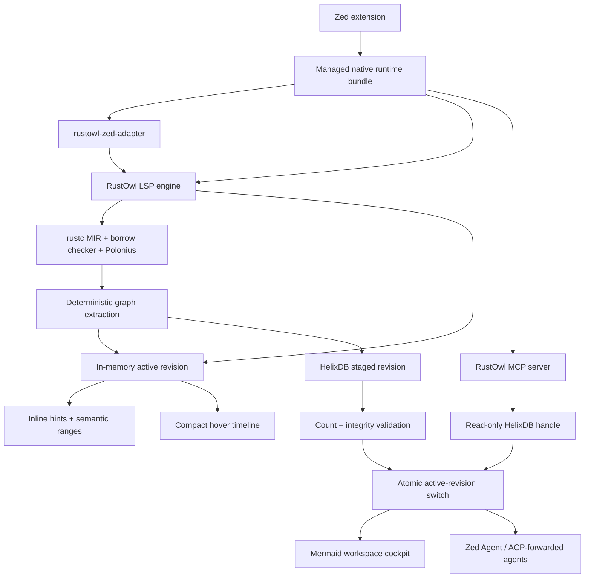
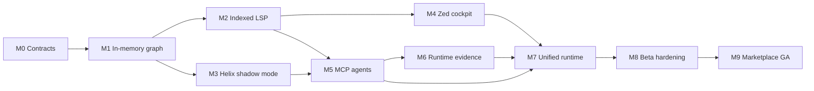

# RustOwl ownership cockpit roadmap

## Vision

RustOwl should become a compiler-grounded ownership cockpit for an entire Rust
workspace. It should explain the selected line immediately, trace ownership
through functions and asynchronous suspension points, render navigable flow
maps, and give editor agents the same structured facts through MCP.

The source of truth remains Rust compiler analysis. HelixDB stores and queries
the resulting graph; it does not infer Rust semantics.

The product has four connected surfaces:

1. **Inline HUD** — one high-signal ownership hint per visible line.
2. **Native hover** — a compact explanation and short ownership timeline.
3. **Workspace cockpit** — detailed Mermaid and structured graph views opened
   beside the source file.
4. **Agent context** — bounded MCP tools and prompts available in Zed's Agent
   Panel.

## Implementation snapshot — 2026-08-10

M0–M5 are implemented in the `0.1.3` marketplace candidate: deterministic
compiler graph extraction, indexed LSP methods, embedded Helix persistence,
automatic Zed visuals, layered hover explanations, six read-only MCP tools,
and three audience-aware agent prompts. M7 packaging is implemented in release
automation. M8
platform and clean-install gates remain mandatory before a tag is promoted;
M9 remains the upstream marketplace submission.

M6 is not part of the static-analysis release. Runtime capture remains a
separate, explicitly opt-in design so observed values and paths can never be
confused with compiler-proven possibilities.

## Product principles

- Compiler-proven facts must be distinguishable from source-level inference.
- The last complete revision remains available while a new analysis runs.
- A missing, locked, incompatible, or corrupt index cannot break highlighting.
- Editor latency must not depend on persistence or object storage.
- All indexing is local by default. No source, graph, or telemetry is uploaded.
- Agent tools return the smallest useful subgraph and always report freshness.
- The engine emits structured data. Mermaid and Markdown are renderers.
- Default explanations use source-level names and plain consequences; raw MIR
  places, certainty, and revision provenance remain available in an advanced
  compiler-evidence section.
- Upstream RustOwl attribution, history, and MPL-2.0 requirements remain intact.

## Product truth and scope boundaries

RustOwl explains the program's ownership story; rust-analyzer remains the
editor authority for symbols, types, navigation, completion, and ordinary Rust
diagnostics. RustOwl adds rustc/MIR/borrow-checker evidence that
rust-analyzer does not currently expose. The extension must run alongside the
native Zed Rust language server rather than replace or fork it.

The ownership graph describes static program semantics, not an observed
runtime execution. It may prove or conservatively describe possible paths, but
must never claim that a branch executed, that a call target was dynamically
selected, or that a value contained particular runtime data. Runtime values,
executed paths, and temporal state would require an explicitly separate
debugger or instrumentation integration in a later product.

Every user and agent surface follows the same truth contract:

- **compiler-proven** facts may use definitive language;
- **source-resolved** relationships identify their source-level resolver;
- **conservative** paths use “may” language and explain the over-approximation;
- **unresolved** boundaries name what the compiler graph could not connect; and
- stale facts always name their completed revision and never masquerade as the
  current unsaved document.

“Live” initially means a responsive presentation of the latest complete
revision, immediate invalidation of affected regions, and atomic replacement
after save or a bounded idle debounce. It does not mean running a full
rustc-quality workspace analysis on every keystroke. Compiler and persistence
work are cancellable and must never block editing.

## Target architecture



The LSP process is the only graph writer. The MCP process opens the same
workspace database read-only. Both can serve the last complete revision. The
LSP keeps a bounded in-memory representation of the active and currently
visible subgraphs so common editor requests do not touch the database.

## Runtime packaging

The extension WASM remains a small installer and launcher. Each platform
release contains one native runtime archive:

```text
rustowl-zed-runtime-<target>/
├── rustowl-zed-adapter[.exe]
├── rustowl[.exe]
├── rustowlc[.exe]
├── rustowl-mcp[.exe]
├── LICENSE-MIT
├── LICENSE-MPL-2.0
├── LICENSE-APACHE-2.0
├── THIRD_PARTY_NOTICES.md
├── manifest.json
├── sbom.cdx.json
└── checksums.sha256
```

HelixDB is linked into `rustowl`; users do not install Docker, start a daemon,
create a cloud account, or configure a database URL. The `rustowl` LSP and
`rustowl-mcp` server are built from the same engine revision and shipped in the
same archive so graph schema and protocol versions cannot drift.

The extension registers both capabilities:

```toml
[language_servers.rustowl]
name = "RustOwl"
languages = ["Rust"]

[context_servers.rustowl-ownership]
```

`language_server_command` launches the adapter. `context_server_command`
launches `rustowl-mcp` from the same runtime directory and resolves the project
roots registered by the paired language servers.

Release jobs build and smoke-test all currently supported targets:

- `aarch64-apple-darwin`
- `x86_64-apple-darwin`
- `aarch64-unknown-linux-gnu`
- `x86_64-unknown-linux-gnu`
- `aarch64-pc-windows-msvc`
- `x86_64-pc-windows-msvc`

## Workspace identity and storage

The runtime receives a stable extension work directory. Each workspace is
stored below a key derived from its canonical Cargo root, toolchain, target,
enabled features, and schema major version:

```text
<extension-work>/graph/
└── <workspace-key>/
    ├── ownership-a/
    ├── ownership-b/
    └── ownership.active-slot
```

Paths stored in graph properties are workspace-relative whenever possible.
Dependency source is indexed only when the user enables it. Build output,
generated files, and source outside configured roots are excluded by default.

`ownership.active-slot` is a tiny atomic pointer to the last validated A/B
generation. Each generation contains the revision contract plus native indexed
nodes and typed edges. A changed analysis is built in the inactive generation,
validated, and activated atomically; the other generation is bounded rollback.
An unchanged engine/source fingerprint reuses the active revision.

## Revision model

Every completed compiler analysis creates an immutable `AnalysisRevision`:

```text
revision_id
workspace_key
document_versions
source_fingerprint
compiler_version
engine_version
schema_version
started_at
completed_at
status
node_count
edge_count
diagnostic_count
```

The indexer follows this sequence:

1. Cancel obsolete compiler and index work.
2. Analyze the affected Cargo workspace or package.
3. Convert all completed crate results into a deterministic graph snapshot.
4. Validate local IDs, source spans, edge endpoints, and graph invariants.
5. Publish the in-memory snapshot for editor reads.
6. Write a new staged Helix revision in batches.
7. Validate persisted counts and sample traversals.
8. Atomically mark the revision active.
9. Notify LSP and MCP consumers of the new revision.
10. Retain the previous complete revision until compaction succeeds.

Cancelled, incomplete, or invalid revisions are never activated. Startup
recovers the newest valid complete revision and quarantines abandoned staging
data.

## Ownership graph schema

### Nodes

- `Workspace`
- `Crate`
- `Module`
- `SourceFile`
- `Function`
- `Binding`
- `Place`
- `CallSite`
- `BorrowEvent`
- `MoveEvent`
- `MutationEvent`
- `ReturnEvent`
- `DropEvent`
- `SuspensionPoint`
- `ControlBlock`
- `Diagnostic`
- `AnalysisRevision`

Every semantic node contains a stable external ID, revision ID, source span,
workspace-relative file, compiler identity where available, and certainty.
Event nodes also contain ordering, control-flow block, human label, and the
underlying RustOwl report.

### Edges

- `CONTAINS`
- `DECLARES`
- `OWNS`
- `CALLS`
- `PASSES_TO`
- `MOVES_TO`
- `COPIES_TO`
- `BORROWS_SHARED`
- `BORROWS_MUT`
- `MUTATES_THROUGH`
- `ALIASES`
- `RETURNS_AS`
- `LIVE_ACROSS_AWAIT`
- `OUTLIVES`
- `DROPS_AT`
- `CONTROL_NEXT`
- `MAY_FLOW_TO`
- `REPORTS`

Edges carry source span, program order, certainty, and optional explanation.
Dynamic dispatch, macro expansion, raw pointers, unsafe code, and unresolved
callee identities are represented explicitly rather than silently guessed.

### Certainty

- `compiler_proven` — derived directly from rustc/MIR/borrow-checker facts.
- `source_resolved` — resolved from source-level symbol or call information.
- `conservative` — a sound over-approximation.
- `unresolved` — an observed event whose remote endpoint is unknown.

Clients must render the latter three differently from compiler-proven facts.

### Cross-function fidelity ladder

Cross-function ownership is the hardest semantic workstream and is delivered
in explicit fidelity levels. HelixDB cannot infer missing relationships.

1. Direct free functions and inherent methods with compiler identities.
2. Argument-to-parameter, receiver, returned-place, and field/projection flow.
3. Generic monomorphizations and statically resolved trait implementations.
4. Closures, captured places, async-generated state, and suspension points.
5. Trait objects, function pointers, macros, FFI, raw pointers, and unsafe
   boundaries represented as bounded conservative or unresolved edges.

Each level has compiler fixtures and graph snapshots. A query stops at an
unresolved boundary unless the caller explicitly requests conservative
expansion. No renderer upgrades uncertainty into a definitive ownership
transfer.

### Prior art adoption gates

The pinned [`references/`](../references/README.md) projects are a design and
validation corpus, not production dependencies. Before graph schema version 1
is frozen, the engine team must publish two architecture decisions:

1. **Place Capability Graph compatibility.** Compare RustOwl's model with PCG
   capabilities, place projections, lifetime projections, reborrowing,
   packing/unpacking, branch joins, loop abstractions, nested borrows, and
   modular call abstractions. Decide whether to integrate a properly licensed
   PCG release, map compatible PCG concepts into project-owned types, or
   document why a different representation is required. A weaker ad-hoc model
   is not an acceptable default.
2. **Modular ownership summaries.** Prototype Flowistry-style signature-driven
   summaries and compare them with explicit whole-workspace traversal for
   precision, dependency coverage, cacheability, and query latency. Prefer
   modular evidence when it is equivalent; retain deeper compiler evidence
   when ownership questions require it.

Aquascope, RustViz, BORIS, and OwnSight form the visual-language test corpus.
mind-expander informs source-backed canvas navigation and agent-guided tours.
rust-analyzer informs incremental project identity and invalidation while
remaining the editor's symbol/type authority. Generic syntax and code-graph MCP
tools form an agent-UX benchmark, but cannot supply MIR places, loans, moves,
drops, borrow regions, or async suspension state.

The differentiated product acceptance test is the intersection of:

- compiler-grounded ownership facts with visible certainty;
- a revisioned, persistent Cargo-workspace graph;
- cross-function move, borrow, mutation, return, and drop paths;
- explicit async suspension and cancellation explanations; and
- the exact same bounded evidence in editor and agent surfaces.

Reference source may enter the product only through a separately reviewed,
license-compatible dependency or an independently implemented published
interface. Projects with missing or ambiguous license text are study-only.

## HelixDB integration

HelixDB sits behind an engine-owned interface with an in-memory implementation
used for parity and fallback:

```rust
trait OwnershipGraphStore {
    async fn stage_revision(&self, graph: &WorkspaceGraph) -> Result<RevisionReceipt>;
    async fn activate(&self, receipt: RevisionReceipt) -> Result<()>;
    async fn inspect_range(&self, query: RangeQuery) -> Result<RangeFacts>;
    async fn trace(&self, query: FlowQuery) -> Result<OwnershipFlow>;
    async fn workspace_map(&self, query: MapQuery) -> Result<WorkspaceMap>;
    async fn recover(&self) -> Result<RecoveryReport>;
}
```

The production implementation uses HelixDB's embedded writer and read-only
clients. The engine never connects to Helix Cloud automatically.

The production pin references immutable HelixDB commit
`ce7392958f466d118328864d7e514e58ad01204f`, is mirrored in
`references/helix-db`, and is recorded in the software bill of materials. The
current crates.io package exposes the query SDK but does not publish the
embedded feature, so the marketplace candidate uses the reviewed immutable Git
revision rather than a moving branch. A future dependency update may move to:

1. an official HelixDB release that publishes embedded support;
2. a newer immutable Git revision tested in every release job; or
3. a reviewed vendored snapshot with its Apache-2.0 notices and provenance.

The storage trait and parity suite prevent this dependency decision from
coupling graph semantics to one database implementation.

## LSP protocol

### `rustowl/inspectRange`

Returns all ownership facts for a visible range in one request, replacing the
adapter's identifier-by-identifier cursor prefetch.

Request fields:

- document URI and version;
- visible LSP range;
- requested fact classes;
- maximum event count; and
- optional previous revision.

Response fields:

- active revision and freshness;
- semantic ranges and inline hints;
- compact flow references;
- truncation and continuation information; and
- analysis status.

### `rustowl/ownershipGraph`

Returns a bounded graph rooted at a binding, place, function, source position,
or external graph ID. The request controls direction, edge kinds, call depth,
event count, inclusion of dependencies, and confidence floor.

### `rustowl/workspaceMap`

Returns crate, module, file, function, and ownership-risk summaries suitable
for a cockpit overview.

### `rustowl/analysisStatus`

Returns the active revision, in-progress revision, analyzed roots, staleness,
compiler status, index status, recovery state, and last error.

### `rustowl/analysisUpdated`

A server notification emitted only after a complete revision becomes active.
It includes changed files/functions and lets clients refresh selectively.

All new methods are versioned and capability-negotiated. Existing
`rustowl/cursor` clients continue working.

## Zed editor experience

### Inline HUD

- Request one visible range rather than one cursor request per identifier.
- Show at most one primary hint per line.
- Preserve all semantic ranges for underlines and hover selection.
- Add async retention, drop, mutation-through-reference, and unresolved-call
  indicators.
- Never show a definitive “moved” claim when the graph only knows “move or
  call”.

### Native hover

- Primary ownership rule and RustOwl's exact compiler report.
- Other active facts on one compact line.
- A bounded timeline of the selected value.
- Freshness and uncertainty only when action is required.
- A graph reference that the cockpit and agent tools can reuse.

### Workspace cockpit

Until Zed exposes custom extension panes, the engine and MCP server return
bounded structured slices and Mermaid source that can be opened beside the
source or rendered in an agent response. Supported views include:

- selected value flow;
- selected function memory/ownership state machine;
- caller/callee ownership transfer;
- async suspension and cancellation state;
- workspace ownership hotspots; and
- borrow conflict explanation with relevant control-flow branches.

No cockpit artifact is written into the user's tracked source tree.

## Zed Agent and MCP experience

Zed supports extension-provided MCP servers in the Agent Panel through
`context_server_command`. The runtime exposes a local stdio server using the
official Rust MCP SDK. Zed Agent uses it directly; external agents can receive
configured MCP servers through ACP where supported. Terminal-based agents can
launch the same `rustowl-mcp --workspace <cargo-root>` command from their own
MCP configuration.

Zed currently supports MCP tools and prompts, so the initial integration does
not depend on resource discovery or subscriptions.

### Read-only tools

Keep the initial tool list focused so models select the correct tool:

#### `rustowl_workspace_summary`

Summarizes active workspace revisions, graph node/edge kinds, certainty counts,
and index freshness.

#### `rustowl_inspect_range`

Returns bounded ownership, liveness, borrow, mutation, drop, async, and
uncertainty evidence for one workspace-relative source range.

#### `rustowl_trace_ownership`

Traverses a value forward or backward through calls, moves, borrows, returns,
mutation, awaits, and drops. Inputs include depth, edge filters, confidence
floor, and result budget.

#### `rustowl_render_mermaid`

Renders a previously returned graph reference as bounded Mermaid source. The
structured graph remains canonical; this tool exists for visual reasoning and
chat responses.

#### `rustowl_search`

Searches binding, place, function, event, and diagnostic labels and returns
stable IDs for follow-up tracing.

#### `rustowl_async_state`

Returns compiler-derived suspension points, retained future state, resume
relationships, and cancellation/drop cleanup.

All tools are read-only. Reanalysis remains an editor/save operation during
the first release, avoiding surprising CPU-heavy tool calls from an agent.

### Prompts

- `debug-rust-ownership` — explain a selected ownership path at the requested
  experience level.
- `explain-rust-async-state` — inspect retained state, cancellation, and
  suspension evidence before proposing changes.
- `plan-rust-ownership-refactor` — use graph facts to plan a refactor while
  preserving behavior and identifying uncertain edges.

### Tool response contract

Every tool response includes:

- workspace key and active revision;
- freshness of the latest committed compiler revision;
- analyzed source/config fingerprint;
- compiler and engine versions;
- facts, graph IDs, and workspace-relative source spans;
- certainty for every inferred relationship;
- explicit truncation when a bounded graph slice reaches its limit.

Defaults are deliberately bounded, with hard caps of 500 nodes, 12 traversal
hops, and 100 search matches. Source text is not returned; tools identify
source-backed spans and stable graph entities.

Runtime-aware responses additionally contain a run ID, executable build ID,
static graph revision, capture policy, observed timestamp/sequence, and the
evidence class `observed_in_run`. Observed evidence never changes the certainty
of a static edge: one run can prove that a path executed in that run, but
cannot prove that other statically possible paths are unreachable.

### Agent configuration and privacy

- Installation registers the server, but users choose which Agent Profiles
  can access its tools.
- The README shows how to enable RustOwl tools in Zed's profile manager.
- Tool descriptions state that results may be sent to the user's selected
  model provider when used in a chat.
- No credentials are required.
- No graph data leaves the machine except through a user-initiated MCP tool
  response to the configured agent.
- Logs omit source text by default and redact paths outside the workspace.

### Optional runtime evidence tools

Runtime tools are visible only when runtime capture is enabled for the active
workspace:

- `rustowl_list_runtime_runs` returns bounded run metadata, capture policy,
  build/revision compatibility, retention, and health without returning values.
- `rustowl_correlate_runtime_flow` joins a selected run's observed calls,
  logical moves, mutations, returns, drops, tasks, and suspension events to a
  bounded static ownership path.

MCP tools never launch or instrument a program. Capture starts only through an
explicit editor command or `rustowl run --capture`, so an agent cannot silently
execute code, increase instrumentation, or collect values.

## Runtime evidence and static correlation

Runtime evidence is a separate opt-in graph namespace stored alongside, but
never merged into, the immutable static ownership graph. Rust borrows and many
moves do not exist as inspectable runtime objects after compilation; therefore
ordinary logs, a debugger, or HelixDB alone cannot reconstruct the ownership
model. The runtime lane correlates compiler-assigned static graph IDs with
instrumented logical program events.

Each capture produces an immutable `RuntimeRun` containing:

- executable build ID, toolchain, features, target, and source fingerprint;
- compatible static analysis revision and graph schema;
- process, thread, async task, tracing span, and monotonic event sequence;
- observed calls, logical moves/copies, borrows, mutations, returns, drops,
  task spawn/join, suspension, resume, cancellation, panic, and unwind events;
- capture policy, redaction policy, truncation, sampling, and dropped-event
  counts; and
- explicit start/end/crash state and retention deadline.

Runtime nodes and edges use names such as `Run`, `Task`, `RuntimeEvent`,
`ValueSnapshot`, `OBSERVED_NEXT`, `OBSERVED_CALL`, `OBSERVED_MUTATION`,
`OBSERVED_RETURN`, `OBSERVED_SUSPEND`, and `CORRELATES_WITH_STATIC`. A logical
move event means “the instrumented MIR ownership operation executed”; it does
not claim that machine code physically copied bytes.

Capture has four escalating policies:

1. **control only** — graph IDs, event classes, task/thread IDs, and timing;
2. **metadata** — type identity, size, discriminant where safely available,
   collection length, and a keyed value hash;
3. **approved values** — user-selected types/fields implementing an explicit
   safe capture trait, with redaction and byte limits; and
4. **experimental taint** — separately enabled propagation for targeted data
   flow questions, never a marketplace default.

Arbitrary memory, raw pointers, reference targets, credentials, environment
variables, files, network payloads, and `Debug` output are not captured by
default. Capture code must not retain references, invoke surprising user code,
change drop order, or panic across the instrumentation boundary. Secret and
PII deny rules run before persistence. All runs are local, encrypted at rest
when value capture is enabled, size/age bounded, individually deletable, and
excluded from diagnostic bundles unless the user explicitly includes them.

The first implementation uses compiler/MIR instrumentation and `tracing`
correlation rather than debugger scraping. Debugger, eBPF, sanitizer, and
OpenTelemetry importers may become adapters later, but their evidence source
must remain explicit.

## Performance objectives

These objectives apply to the graph and presentation layer after a compiler
analysis has completed:

- cached hover p95: under 30 ms;
- visible-range query p95: under 50 ms for 2,000 source lines;
- six-hop ownership trace p95: under 100 ms for 50 returned nodes;
- MCP workspace overview p95: under 200 ms;
- in-memory graph activation: under 100 ms for 100,000 events;
- persisted revision activation: under 1 second for 100,000 events;
- MCP cold start to first read: under 500 ms excluding OS disk cold-cache;
- zero stale revision mix-ups across document versions;
- bounded index growth with configurable revision retention;
- zero runtime overhead when capture is disabled;
- control-only capture overhead measured against an uninstrumented build with
  a release target below 5% on the benchmark corpus; and
- bounded value-capture memory, disk, and event-queue usage under configured
  backpressure.

These are release gates, not assumptions. Benchmarks record CPU, wall time,
peak memory, database size, write amplification, and shutdown flush time.

Analysis cadence is measured separately from query latency. The benchmark
suite records clean-workspace analysis, incremental save analysis, rapid edit
cancellation, time until stale ranges disappear, and time until a complete
revision becomes visible. Default debounce and package invalidation policies
must be justified by these measurements rather than a fixed marketing claim.

## Reliability and security gates

- Single-writer locking and read-only MCP access.
- Atomic revision activation and crash recovery tests at every write phase.
- Schema migrations are forward-only, versioned, and tested from every
  released schema still supported.
- A corrupt index is quarantined and rebuilt without losing editor service.
- All query inputs have depth, size, time, and path-boundary limits.
- MCP tools cannot read arbitrary filesystem paths.
- Mermaid labels are escaped to prevent directive or link injection.
- runtime capture is off by default, requires explicit per-run consent, and
  cannot be started through MCP;
- static and observed evidence live in different schema namespaces and every
  correlation validates build/source/revision compatibility;
- value capture has allow/deny rules, redaction, encryption, retention, and
  deletion tests;
- Release archives contain licenses, notices, checksums, and an SBOM.
- CI pins third-party Git revisions and rejects lockfile drift.
- Release artifacts are built on all target platforms and smoke-tested before
  publication.

## Delivery milestones

### M0 — contracts and benchmark harness

Deliverables:

- versioned graph domain types;
- stable external-ID rules;
- schema and certainty documentation;
- representative workspace fixtures;
- benchmark corpus and measurement harness;
- LSP/MCP JSON contract fixtures;
- a PCG semantic compatibility report and schema decision ADR;
- a modular ownership-summary prototype and Flowistry comparison ADR; and
- a pinned prior-art manifest with license and provenance boundaries.

Exit criteria:

- graph snapshots are deterministic across repeated analysis;
- PCG comparison fixtures cover capabilities, partial places, reborrows,
  nested lifetimes, join points, loop summaries, and call abstractions;
- modular summaries are compared against explicit traversal on representative
  workspace calls and dependencies;
- fixtures cover moves, copies, shared/mutable borrows, fields, branches,
  loops, generics, traits, closures, macros, async/await, cancellation, drops,
  unsafe boundaries, and multi-crate calls.

### M1 — complete in-memory workspace graph

Deliverables:

- extraction from every analyzed file/function;
- binding/place/event nodes and intra-function edges;
- direct call/argument/return edges where compiler identity is available;
- a cross-function fidelity matrix covering direct calls, receivers,
  parameters, projections, generics, traits, closures, async state, macros,
  dynamic dispatch, FFI, and unsafe boundaries;
- explicit unresolved/dynamic edges; and
- bounded range, trace, and workspace-map queries.

Exit criteria:

- no cursor scan is required to discover a file's analyzed events;
- graph counts and edge endpoints pass integrity validation;
- existing decoration tests remain compatible.

### M2 — indexed LSP protocol

Deliverables:

- `inspectRange`, `ownershipGraph`, `workspaceMap`, and `analysisStatus`;
- `analysisUpdated` notification;
- document/revision freshness enforcement; and
- compatibility fallback to `rustowl/cursor`.

Exit criteria:

- one visible-range request replaces identifier fan-out;
- stale responses are rejected deterministically;
- protocol golden tests pass across Linux, macOS, and Windows.

### M3 — HelixDB shadow persistence

Deliverables:

- embedded, immutable HelixDB dependency pin;
- graph-store interface and in-memory/Helix parity suite;
- staged/active revision lifecycle;
- recovery, compaction, retention, and schema metadata; and
- LSP writer plus separate read-only test process.

Exit criteria:

- Helix and in-memory queries return semantically equivalent bounded graphs;
- killing the writer at every activation phase preserves the previous active
  revision;
- disabling or deleting persistence leaves the editor fully functional;
- performance objectives are measured and accepted.

### M4 — Zed indexed editor experience

Deliverables:

- adapter consumes `inspectRange` and `ownershipGraph`;
- automatic multi-value inline HUD;
- compact flow-aware hovers;
- async, mutation, drop, and uncertainty helpers; and
- generated Mermaid cockpit document.

Exit criteria:

- real Zed Preview smoke tests show complete visuals without prior hover;
- stacked rust-analyzer/RustOwl hover remains readable;
- no native RustOwl hover card requires its own scrollbar in standard cases.

### M5 — Agent Panel MCP integration

Deliverables:

- `rustowl-mcp` stdio server using the official Rust MCP SDK;
- six read-only tools and three prompts;
- Zed `context_servers.rustowl-ownership` registration;
- shared read-only workspace index discovery;
- response budgets, freshness, certainty, and path controls; and
- MCP inspector plus Zed Agent Panel smoke tests.

Exit criteria:

- a fresh extension install exposes RustOwl tools in Zed's profile manager;
- an enabled Zed Agent can trace a six-function ownership flow and cite the
  exact relevant spans;
- an enabled Zed Agent can explain a non-`Send` future, identify a borrow that
  crosses `.await`, assess callers affected by changing a parameter from
  borrowed to owned, and plan removal of a `clone` without inventing runtime
  state;
- an external ACP agent can use the forwarded server where supported;
- no tool can escape the active project roots or return unbounded output.

### M6 — opt-in runtime evidence

Deliverables:

- runtime evidence schema and static-correlation contract;
- compiler/MIR event IDs and control-only instrumentation;
- `rustowl run --capture` with explicit policies and local run lifecycle;
- Helix run storage isolated from static revisions;
- tracing/thread/async-task correlation and cancellation/panic handling;
- optional approved-value capture trait, redaction, encryption, retention, and
  deletion controls; and
- two bounded read-only runtime MCP tools.

Exit criteria:

- a captured six-function run correlates observed events to the exact static
  graph IDs and source spans without relabeling possible paths as executed;
- async task suspension, resume, cancellation, and cross-thread movement are
  distinguishable in a real Tokio fixture;
- disabled capture has zero runtime instrumentation behavior;
- overhead, backpressure, crash recovery, redaction, secrets, retention, and
  deletion gates pass;
- agents cannot start capture or retrieve values outside the selected run and
  capture policy.

### M7 — unified runtime and supply chain

Deliverables:

- one versioned runtime archive per target;
- extension-side installation and cleanup;
- artifact manifest/checksum verification;
- license and SBOM generation;
- engine/adapter protocol compatibility check; and
- upgrade and rollback handling.

Exit criteria:

- clean-machine tests require only Zed and a Rust project;
- no Docker, Helix service, Node.js, Python, or manual RustOwl installation;
- upgrade preserves or safely rebuilds compatible workspace indexes;
- all six platform artifacts pass installation and basic graph/MCP smoke tests.

### M8 — beta hardening

Deliverables:

- opt-in beta release and diagnostic bundle command;
- large-workspace, monorepo, offline, and low-disk tests;
- cancellation and rapid-edit stress tests;
- accessibility and color/theme review;
- privacy, security, licensing, and marketplace review; and
- performance regression dashboards.

Exit criteria:

- no known data-loss, stale-fact, path-escape, or editor-blocking defects;
- graph fallback works under all injected Helix failures;
- documented limits and recovery behavior match observed behavior.

### M9 — marketplace GA

Deliverables:

- Zed Marketplace submission;
- signed production releases and provenance;
- upgrade policy and supported engine/schema matrix;
- user documentation, examples, and troubleshooting; and
- upstream contribution plan for generally useful RustOwl protocol additions.

Exit criteria:

- production SLOs pass on the release candidate;
- clean installs and upgrades pass on every supported target;
- Agent Panel, editor visuals, and offline fallback are verified end-to-end;
- all UI and MCP golden tests enforce the shared certainty/freshness language
  and reject claims about executed branches or runtime values.

## Release strategy

- Engine preview: `0.5.0-rustyauth.N`
- Zed extension preview: `0.2.0-beta.N`
- First graph/MCP GA: Zed extension `0.2.0`
- Graph schema begins at `1` and has an explicit compatibility matrix.
- Preview builds keep Helix persistence behind a setting until M3 gates pass.
- Marketplace GA enables persistence by default only after recovery and
  performance gates pass; users can always choose memory-only mode.

## Workstream dependency order



Helix persistence and indexed LSP development can proceed after the graph
contract stabilizes. Agent integration must not begin against an unstable
graph schema. Runtime instrumentation follows the static/MCP truth contract,
and unified packaging must contain actual tested engine, recorder, and MCP
artifacts rather than placeholders.

## Immediate implementation queue

1. Add graph IDs, revision, node, edge, certainty, span, and snapshot types to
   the engine fork.
2. Build deterministic extraction for existing `Crate`, `File`, `Function`,
   `MirDecl`, `MirStatement`, and `MirTerminator` models.
3. Add fixture snapshot tests and graph integrity validation.
4. Implement in-memory range/trace/map queries.
5. Specify and test the new LSP JSON contracts.
6. Prototype pinned embedded HelixDB behind the graph-store interface.
7. Benchmark persistence before wiring it into editor startup.
8. Replace adapter prefetch fan-out with `inspectRange`.
9. Add MCP only after a separate process can read an active graph revision
   safely.

This ordering delivers immediate editor speed improvements while protecting
the deeper workspace and agent vision from premature storage coupling.

## Design references

- [Zed MCP server extensions](https://zed.dev/docs/extensions/context-servers)
- [MCP support in Zed](https://zed.dev/docs/ai/mcp)
- [Zed Agent Profiles and MCP tool availability](https://zed.dev/docs/ai/agent-profiles)
- [Official Rust MCP SDK](https://github.com/modelcontextprotocol/rust-sdk)
- [HelixDB](https://github.com/HelixDB/helix-db)
- [Original RustOwl project](https://github.com/cordx56/rustowl)
